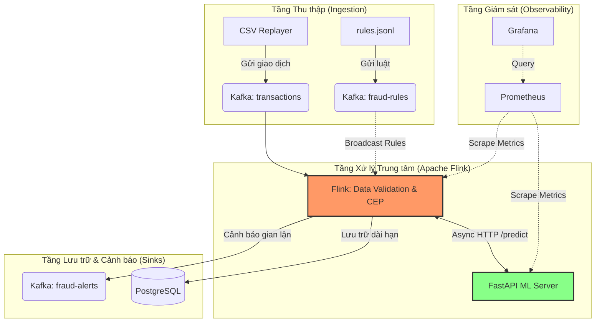

# 🛡️ Hệ Thống Phát Hiện Gian Lận Theo Thời Gian Thực v3.0 (Real-Time Fraud Detection Pipeline)

Một hệ thống dữ liệu (data pipeline) hoàn chỉnh, sẵn sàng cho môi trường production dùng để phát hiện gian lận thẻ tín dụng theo thời gian thực. Dự án này kết hợp sức mạnh xử lý luồng sự kiện phức tạp (CEP) của **Apache Flink** và Engine học máy **Machine Learning** (XGBoost) được triển khai qua FastAPI. Hệ thống cũng đi kèm với tính năng giám sát toàn diện thông qua **Prometheus & Grafana**, khả năng thay đổi luật và mô hình ML linh hoạt (Hot-swapping / Model Versioning) mà không cần thời gian downtime (zero-downtime).

---

## 🏗️ Kiến trúc & Luồng dữ liệu (Data Flow)

Hệ thống hoạt động đồng thời dựa trên 2 nhánh: Các quy tắc cố định (Rule-based heuristics) và Trí tuệ nhân tạo (AI-driven probability engine).



1. **Thu thập dữ liệu (Mô phỏng):** Một script Python (`scripts/csv_replayer.py`) đọc dữ liệu thẻ tín dụng từ Kaggle và giả lập đẩy các sự kiện (JSON) vào Kafka topic `transactions`.
2. **Luật Động (Dynamic Rule Injection):** Các luật gian lận (`rules.jsonl`) được đẩy vào Kafka topic `fraud-rules` và được broadcast liên tục cho toàn bộ cụm Flink mà không cần khởi động lại.
3. **Engine Xử Lý Luồng (Apache Flink):**
   - **Data Validation:** Xác thực dữ liệu Kafka, nếu gặp data lỗi/thiếu trường, Flink sẽ ghi nhận vào metric `malformedMessages` thay vì làm sập pipeline.
   - **CEP Engine:** Theo dõi chuỗi hành vi theo thời gian (VD: 3 giao dịch nhỏ dưới $10 trong 60 giây -> Cảnh báo `P001`; Nhiều lần bị từ chối sau đó thành công -> Cảnh báo `P003`).
   - **Broadcast State:** Khớp dữ liệu thời gian thực với luật động (VD: Giao dịch số tiền lớn ở quốc gia lạ -> Cảnh báo `P002`).
   - **Machine Learning (Async I/O):** Flink gọi bất đồng bộ đến FastAPI server để nhận điểm xác suất gian lận.
4. **Data Sinks:** Các cảnh báo từ cả AI và luật được gộp lại và bắn ra Kafka (`fraud-alerts`) và PostgreSQL (`fraud_alerts`).
5. **Observability:** Prometheus thu thập chỉ số (throughput, latency, tỷ lệ lỗi) từ Flink và FastAPI để Grafana trực quan hóa lên Dashboard.

---

## 📂 Cấu trúc Dự Án

```text
.
├── docker-compose.yml          # Triển khai Hạ tầng (Kafka, Postgres, Prometheus, Grafana)
├── .env                        # Các biến môi trường và mật khẩu (Ports, Credentials)
├── init-db/                    # Script khởi tạo PostgreSQL
│   └── 01_schema.sql           # Schema cho bảng `transactions` và `fraud_alerts`
├── ml/                         # Module Machine Learning
│   ├── download_dataset.sh     # Tải dữ liệu Kaggle
│   ├── train_model.py          # Script huấn luyện XGBoost (có áp dụng SMOTE)
│   ├── model_server.py         # FastAPI quản lý `/predict` và `/models`
│   ├── tests/                  # Bộ Test tự động cho FastAPI
│   └── models/                 # Registry (`model_registry.json`) và các file .pkl
├── monitoring/                 # Module Giám sát
│   ├── prometheus.yml          # Cấu hình Prometheus Scraping
│   └── grafana/                # Cấu hình và Dashboard Grafana
├── pom.xml                     # Thư viện Maven cho Flink
├── rules.jsonl                 # Danh sách luật động 
├── scripts/                    # Các tiện ích
│   ├── create_topics.sh        # Script tạo Kafka topics
│   └── csv_replayer.py         # Trình mô phỏng giao dịch
└── src/main/java/com/fraud/    # Mã nguồn trung tâm Apache Flink (Java 17)
    ├── config/                 # Cấu hình Pipeline
    ├── function/               # Flink functions (Async ML Inference, Broadcast Rules)
    ├── model/                  # Data objects (Transaction, FraudAlert, FraudRule)
    ├── pattern/                # Flink CEP Patterns (Phân tích chuỗi hành vi)
    ├── serialization/          # Kafka Deserializers & Validation
    └── sink/                   # Kết nối PostgreSQL JDBC
```

---

## 🛠️ Công Nghệ Sử Dụng

- **Stream Processing:** Apache Flink 1.20 (Java 17)
- **Message Broker:** Apache Kafka 7.6 & Confluent ZooKeeper
- **Database:** PostgreSQL 16
- **Observability:** Prometheus & Grafana
- **Machine Learning:** XGBoost, Scikit-Learn, Pandas
- **Model Server:** FastAPI, Uvicorn, Python 3.12 (uv)
- **Kiểm thử (Testing):** JUnit 5, Flink Test Utils, Pytest

---

## ⚙️ Yêu Cầu Cài Đặt (Prerequisites)

- **Java 17** và **Maven 3.8+**
- **Python 3.11/3.12** với `uv` hoặc `pip`
- **Docker 24+** (hỗ trợ Docker Compose v2)
- **Apache Flink 1.20** được giải nén sẵn (VD: `~/flink-1.20.0`). 
  - *Lưu ý: Đảm bảo copy file JAR `flink-metrics-prometheus` vào thư mục `plugins/metrics-prometheus/` của Flink.*
  - *Lưu ý: Chỉnh cấu hình `metrics.reporter.prom.port: 9249-9260` trong `config.yaml`.*
- **Kaggle API Credentials** (`~/.kaggle/kaggle.json`) để tải dữ liệu training.

---

## 🗺️ Port Mapping

*(Các port này có thể thay đổi linh hoạt thông qua file `.env`)*

| Port       | Dịch vụ                        | Chức năng                                    |
|------------|--------------------------------|----------------------------------------------|
| 8081       | Flink Web UI                   | Theo dõi Job Flink và Backpressure           |
| 9093       | Kafka Broker (External)        | Nơi kết nối Kafka producer/consumer          |
| 2182       | ZooKeeper                      | Quản lý Kafka cluster                        |
| 5433       | PostgreSQL                     | Kết nối Database (`frauddb`)                 |
| 8001       | FastAPI ML server              | Endpoints: `/predict`, `/models`, `/metrics` |
| 9090       | Prometheus                     | Giám sát metric                              |
| 3000       | Grafana                        | Xem Dashboard Thời gian thực                 |
| 9249-9260  | Flink Prometheus Reporters     | Thu thập số liệu nội bộ của Flink            |

---

## 🚀 Hướng Dẫn Khởi Chạy

Bạn nên sử dụng nhiều cửa sổ Terminal để chạy lần lượt các bước dưới đây.

### 1. Hạ tầng (Infrastructure)
Bật Kafka, Zookeeper, Postgres, Prometheus và Grafana. Đừng quên copy `.env.example` thành `.env` trước nhé!
```bash
docker compose up -d
```

### 2. Thiết lập Kafka & Nạp Luật ban đầu
```bash
# Tạo các topics cần thiết
./scripts/create_topics.sh

# Bắn file JSON vào Kafka để nạp luật động cho Flink
cat rules.jsonl | docker exec -i fraud-kafka \
  kafka-console-producer --bootstrap-server localhost:9092 --topic fraud-rules
```

### 3. Trí tuệ Nhân tạo (Machine Learning)
```bash
# Tải bộ dataset (yêu cầu Kaggle API key)
./ml/download_dataset.sh

# Huấn luyện mô hình XGBoost. (Chỉ lưu model nếu AUROC >= 0.85)
# LƯU Ý: Nếu bạn đã có model trong `ml/models/` và không muốn train lại, BẠN CÓ THỂ BỎ QUA bước này.
uv run python ml/train_model.py
```

### 4. Bật API Model Server (Terminal A)
Giữ Terminal này luôn chạy để Flink có thể giao tiếp với AI và Prometheus có thể lấy metric.
```bash
uv run uvicorn ml.model_server:app --host 0.0.0.0 --port 8001
```

### 5. Khởi động Apache Flink (Terminal B)
Bật cụm Flink cục bộ.
```bash
export FLINK_HOME=~/flink-1.20.0
$FLINK_HOME/bin/start-cluster.sh
```
*Truy cập [http://localhost:8081](http://localhost:8081) để kiểm tra UI của Flink.*

### 6. Biên dịch Java Code và Nộp Job (Terminal C)
Dùng Maven để đóng gói Fat JAR và triển khai lên Flink.
```bash
mvn clean package -DskipTests
$FLINK_HOME/bin/flink run -d target/fraud-detection-pipeline-1.0.jar
```

### 7. Bật Trình Giả Lập Dữ Liệu (Terminal D)
Script này sẽ giả vờ làm cổng thanh toán, bơm liên tục các giao dịch vào Kafka nhanh gấp 5 lần bình thường.
```bash
uv run python scripts/csv_replayer.py --speed 5
```

---

## 📊 Quan Sát (Monitoring & Observability)

Sau khi dòng dữ liệu bắt đầu chảy, bạn có thể kiểm tra sức khỏe hệ thống:

1. **Grafana Dashboard:** Vào `http://localhost:3000` (User: `admin` / Pass: `fraudadmin` - hoặc xem trong `.env`). Mở **Dashboards > Fraud Pipeline**.
   - Tại đây hiển thị: Tốc độ xử lý (Records/sec), Độ trễ của Model, Tổng giao dịch đã xử lý và số lượng dữ liệu lỗi (Malformed Messages).
2. **Kiểm tra Database:**
   ```bash
   docker exec -i fraud-postgres psql -U frauduser -d frauddb -c "
   SELECT pattern_name, severity, amount, source FROM fraud_alerts LIMIT 5;
   "
   ```

---

## 🧠 Quản Lý Phiên Bản Model (Hot-Swapping)

Server Machine Learning lưu toàn bộ lịch sử các mô hình đã huấn luyện trong `model_registry.json`.
Giả sử bạn vừa tune lại thông số AI và muốn thay đổi mô hình ngay lập tức mà không muốn Flink bị gián đoạn:

1. Chạy `uv run python ml/train_model.py` để ra version mới.
2. Kiểm tra các version đang có sẵn:
   ```bash
   curl -s http://localhost:8001/models
   ```
3. **Hot-Swap Model (Thay nóng):** Kích hoạt version mới (hoặc Rollback về version cũ):
   ```bash
   curl -X POST http://localhost:8001/models/<version-id>/activate
   ```
   *Ngay lập tức, Server AI sẽ nạp mô hình mới vào RAM, và Flink sẽ được dùng mô hình mới nhất này cho các giao dịch tiếp theo.*

---

## 🧪 Kiểm Thử (Automated Testing)

Hệ thống được đảm bảo bằng bộ Test chạy song song trên 2 ngôn ngữ:
- **Test Java (Flink CEP/Rules):** Đảm bảo không block nhầm khách hàng.
  ```bash
  mvn clean test
  ```
- **Test Python (FastAPI/ML Server):** Đảm bảo API scale dữ liệu chuẩn xác, và tính năng chuyển đổi model linh hoạt.
  ```bash
  uv run pytest ml/tests/
  ```

## 🔄 Hướng Dẫn Chạy Lại Từ Đầu (Reset Dữ Liệu Cũ)

Nếu bạn muốn xóa sạch toàn bộ dữ liệu (Kafka, PostgreSQL, Grafana, Flink Checkpoints) để chạy lại một vòng đời hoàn toàn mới, hãy làm theo các bước sau:

1. **Dừng và xóa toàn bộ Docker Containers kèm Volumes**:
   ```bash
   docker compose down -v
   ```
   *(Cờ `-v` rất quan trọng, nó sẽ xóa các named volumes chứa dữ liệu cũ của Postgres và Grafana).*

2. **Xóa Flink Checkpoints cũ**:
   ```bash
   rm -rf /tmp/flink-checkpoints/
   ```

3. **(Tùy chọn) Xóa các model ML đã train**:
   ```bash
   rm -rf ml/models/*.pkl ml/models/model_registry.json ml/models/*.tmp_link
   ```

4. **Khởi động lại toàn bộ theo trình tự**:
   Lặp lại các bước ở mục **Hướng Dẫn Khởi Chạy** từ Bước 1 đến Bước 7. Đảm bảo bạn gọi lại tập lệnh `./scripts/create_topics.sh` vì Kafka đã bị reset hoàn toàn.
   *(Lưu ý: Nếu ở Bước 3 bạn không xóa model ML, bạn có thể bỏ qua lệnh `train_model.py` và tiến thẳng sang Bước 4 bật API Server).*

---

## 🛑 Hướng Dẫn Tắt Hệ Thống

```bash
# Tắt Flink Cluster
$FLINK_HOME/bin/stop-cluster.sh

# Xóa các container Docker
docker compose down
```
