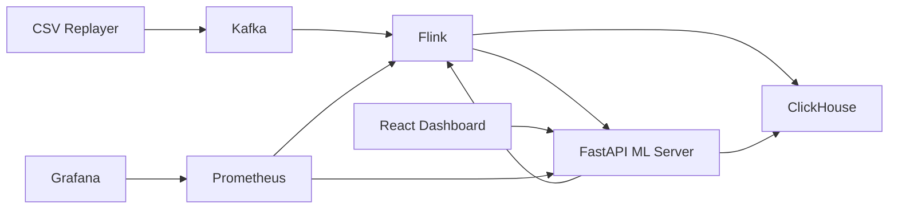

# Real-Time Fraud Detection Pipeline

Hệ thống phát hiện gian lận giao dịch thẻ theo thời gian thực, chạy trên Kubernetes cục bộ bằng Minikube. Pipeline dùng Apache Flink để xử lý stream từ Kafka, gọi sang FastAPI ML Server để chấm điểm bằng XGBoost, ghi dữ liệu vận hành vào ClickHouse và hiển thị qua dashboard React, Grafana, Prometheus.

Dự án được thiết kế theo hướng gần với sản phẩm thật:

- Transaction realtime chỉ chứa thông tin giao dịch và feature phục vụ inference.
- Model không nhận `Class`, `status`, `rawLabel` hay bất kỳ ground-truth label nào.
- Label thật, nếu có, được xem là dữ liệu đến sau từ quy trình review, chargeback hoặc dispute.
- Dashboard realtime hiển thị decisioning metrics như probability, alert rate, pending review, không giả định biết fraud thật ngay tại thời điểm giao dịch.
- Chế độ replay label từ Kaggle chỉ dành cho demo/evaluation và phải bật explicit.

## Kiến Trúc Hệ Thống


```mermaid
flowchart LR
    Replay["CSV Replayer"] --> Kafka["Kafka"] --> Flink["Flink"]
    Flink --> ML["FastAPI ML Server"]
    ML --> Flink
    Flink --> CH["ClickHouse"]
    ML --> CH
    UI["React Dashboard"] --> ML
    Prom["Prometheus"] --> ML
    Prom --> Flink
    Graf["Grafana"] --> Prom
```

## Luồng Dữ Liệu

1. `scripts/csv_replayer.py` đọc `ml/data/creditcard.csv`, dựng transaction event và gửi vào Kafka topic `transactions`.
2. Flink đọc Kafka bằng `TransactionDeserializer`, validate schema và metric hóa số message hợp lệ/lỗi.
3. `MLInferenceFunction` gọi async HTTP `POST /predict` sang FastAPI ML Server.
4. Payload inference chỉ gồm:

   ```json
   {
     "transaction_id": "...",
     "run_id": "...",
     "data_source": "...",
     "features": {
       "V1": 0.0,
       "V2": 0.0,
       "...": "...",
       "Amount": 42.0,
       "Time": 123.0
     }
   }
   ```

5. FastAPI trả về `fraud_probability`, `is_fraud`, `model_version`, `algorithm`, `threshold`.
6. Flink ghi:
   - `transactions`: giao dịch, không chứa label thật.
   - `model_predictions`: quyết định realtime; gồm cả score ML và fallback rule khi ML server lỗi.
   - `fraud_alerts`: alert do model hoặc fallback rule tạo ra.
   - `ground_truth`: chỉ ghi khi bật chế độ demo label bằng `ENABLE_DEMO_GROUND_TRUTH=true`.
7. Dashboard tại `http://localhost:30001` đọc prediction công khai và optional delayed review label để hiển thị operation console.
8. Prometheus scrape metrics từ ML Server và Flink; Grafana đọc Prometheus để hiển thị observability.

## Product-Safe Label Handling

Dataset Kaggle có cột `Class`, nhưng trong sản phẩm thật hệ thống không thể biết ngay giao dịch có thật sự gian lận hay không. Vì vậy mặc định:

- `csv_replayer.py` không gửi `Class/status/rawLabel`.
- Flink không ghi `ground_truth` từ stream giao dịch.
- `/predict` reject request có field lạ như `status` hoặc `rawLabel`.
- Dashboard chỉ hiển thị quyết định realtime và audit label đến sau nếu có.

Nếu muốn chạy demo có label để kiểm thử evaluation:

1. Bật `ENABLE_DEMO_GROUND_TRUTH=true` cho Flink JobManager và TaskManager.
2. Build và submit lại Flink job.
3. Replay bằng `make replay-demo-labels`.

Chế độ này chỉ dùng để demo/evaluation, không phải thiết kế production.

## Công Nghệ Chính

| Thành phần | Công nghệ |
|---|---|
| Stream processing | Apache Flink 1.20, Java 17 |
| Message broker | Kafka 7.6 in single-node KRaft mode |
| Model serving | FastAPI, Uvicorn, XGBoost, scikit-learn |
| Analytical storage | ClickHouse |
| Dashboard | React, Vite |
| Observability | Prometheus, Grafana |
| Orchestration | Kubernetes, Minikube |
| Python tooling | uv |

## Cấu Trúc Thư Mục

```text
fraud-detection-pipeline/
├── k8s/                         # Kubernetes manifests
│   ├── clickhouse.yaml           # ClickHouse schema + deployment
│   ├── flink.yaml                # Flink JobManager/TaskManager
│   ├── kafka.yaml                # Kafka broker in KRaft mode, no ZooKeeper
│   ├── ml-server.yaml            # FastAPI ML Server
│   ├── prometheus.yaml           # Prometheus scrape config
│   ├── grafana.yaml              # Grafana dashboard/datasource
│   ├── network-policy.yaml       # Network policies
│   └── secrets.yaml.example      # Secret template
├── ml/
│   ├── dashboard/                # React + Vite source
│   ├── static/                   # Generated dashboard build output, gitignored
│   ├── models/                   # Model artifacts and registry
│   ├── model_server.py           # FastAPI application
│   ├── train_model.py            # Model training
│   ├── download_dataset.sh       # Download Kaggle dataset
│   └── tests/                    # ML server tests
├── scripts/
│   ├── create_topics.sh          # Create Kafka topics
│   ├── csv_replayer.py           # Replay CSV rows into Kafka
│   └── port_forward.sh           # Local port-forward helper
├── src/main/java/com/fraud/
│   ├── FraudDetectionJob.java    # Flink pipeline entrypoint
│   ├── config/                   # Runtime config
│   ├── function/                 # Async ML inference
│   ├── model/                    # Java POJOs
│   ├── serialization/            # Kafka serializers/deserializers
│   └── sink/                     # ClickHouse sinks
├── Makefile
├── pom.xml
├── pyproject.toml
└── README.md
```

## Yêu Cầu Cài Đặt

| Công cụ | Ghi chú |
|---|---|
| Docker | Minikube dùng Docker driver |
| Minikube | Chạy Kubernetes local |
| kubectl | Quản lý cluster |
| Java 17 | Build Flink job |
| Maven | Build fat JAR |
| Python 3.12 | Chạy ML scripts và replayer |
| uv | Quản lý Python environment |
| Node.js/npm | Build dashboard nếu cần |
| Kaggle API key | Chỉ cần khi tải lại dataset |

## Port Localhost

Sau khi chạy `make port-forward`, các service được ánh xạ về máy host:

| Service | URL |
|---|---|
| Fraud Operations Console / ML Server | `http://localhost:30001` |
| Flink Web UI | `http://localhost:30081` |
| Grafana | `http://localhost:30000` |
| Prometheus | `http://localhost:30090` |
| ClickHouse HTTP | `http://localhost:30123` |
| Kafka external listener | `localhost:30093` |

`/predict` yêu cầu `MODEL_API_KEY`. Lấy key từ secret:

```bash
kubectl get secret fraud-pipeline-secrets \
  -o jsonpath='{.data.MODEL_API_KEY}' | base64 -d
```

Grafana user/password local hiện là `admin/admin`.

## Biến Môi Trường Quan Trọng

| Biến | Mặc định | Mô tả |
|---|---:|---|
| `KAFKA_BOOTSTRAP` | `localhost:30093` | Kafka endpoint từ host qua port-forward |
| `TRANSACTIONS_TOPIC` | `transactions` | Topic transaction input |
| `CLICKHOUSE_URL` | `jdbc:clickhouse://localhost:30123/default` | JDBC URL khi chạy local |
| `MODEL_API_KEY` | required | Bảo vệ `/predict` |
| `MODEL_ADMIN_API_KEY` | required for admin | Bảo vệ hot-swap model |
| `ENABLE_DEMO_GROUND_TRUTH` | `false` | Chỉ bật cho labeled replay demo |
| `CHECKPOINT_STORAGE` | `file:///flink-checkpoints/fraud-pipeline` | Flink checkpoint path trong PVC |

Trong Kubernetes, các biến runtime chính nằm ở `k8s/*.yaml` và `k8s/secrets.yaml`; file `.env` chủ yếu phục vụ script chạy từ host.

## Chuẩn Bị Lần Đầu

```bash
# 1. Tạo .env và k8s/secrets.yaml từ template nếu chưa có
make setup-env

# 2. Cập nhật secret thật trong k8s/secrets.yaml
#    - CLICKHOUSE_USER
#    - CLICKHOUSE_PASSWORD
#    - GRAFANA_ADMIN_PASSWORD
#    - MODEL_API_KEY
#    - MODEL_ADMIN_API_KEY

# 3. Cài dependency Python
uv sync

# 4. Tải dataset nếu ml/data/creditcard.csv chưa tồn tại
make download-dataset

# 5. Train model nếu ml/models chưa có artifact
make train
```

Nếu repo đã có sẵn `ml/data/creditcard.csv` và `ml/models/*`, có thể bỏ qua bước tải dataset/train model.

## Chạy Dự Án Từ Đầu

### 1. Khởi động Minikube

```bash
make start-minikube
```

### 2. Build image ML Server vào Docker daemon của Minikube

```bash
make build-image
```

Lệnh này build `fraud-ml-server:latest` và restart `deployment/ml-server` nếu deployment đã tồn tại.

### 3. Dựng hạ tầng Kubernetes

```bash
make infra-up
```

Lệnh này:

- tạo `.env` và `k8s/secrets.yaml` nếu chưa có,
- sửa quyền Kafka PVC trong Minikube,
- apply toàn bộ manifest trong `k8s/`,
- chờ pods ready,
- tạo Kafka topics.

Kiểm tra nhanh:

```bash
kubectl get pods
```

Nếu cluster local của bạn từng chạy bản Kafka dùng ZooKeeper, migrate một lần sang KRaft:

```bash
make migrate-kafka-kraft
```

Lệnh này chỉ xóa Kafka deployment/PVC và ZooKeeper resource cũ vì Kafka log metadata giữa ZooKeeper mode và KRaft mode không tương thích trực tiếp. ClickHouse, model artifacts, dashboard và dữ liệu demo trong ClickHouse không bị xóa.

Nếu bạn đang giữ PVC ClickHouse từ bản cũ, chạy migration schema một lần để thêm các cột degraded-mode cho `model_predictions`:

```bash
make clickhouse-migrate-schema
```

### 4. Build và submit Flink job

```bash
make build-job
make submit-job
```

`make submit-job` sẽ cancel job `Fraud Detection Pipeline` đang chạy trước khi submit JAR mới để tránh nhiều job cùng consumer group/sink chạy song song.

Kiểm tra job:

```bash
kubectl exec deploy/flink-jobmanager -- flink list
```

### 5. Mở port-forward

Chạy ở terminal riêng và giữ nguyên:

```bash
make port-forward
```

### 6. Replay dữ liệu giao dịch

Chạy ở terminal khác:

```bash
make replay
```

Hoặc replay riêng fraud rows để kiểm tra alert nhanh:

```bash
make replay-fraud
```

Lưu ý: `replay-fraud` vẫn không gửi label mặc định; nó chỉ chọn các dòng có `Class=1` trong dataset để tạo nhiều case rủi ro hơn.

## Demo Lại Với Dữ Liệu Sạch

Dùng chuỗi này khi chỉ muốn xoá dữ liệu đã stream ở lần demo trước và gửi lại dữ liệu mới. Lệnh này giữ nguyên Kubernetes pods, PVC, Kafka, Flink job, model artifact và dashboard; nó chỉ xoá các bảng hiển thị trong ClickHouse (`transactions`, `model_predictions`, `fraud_alerts`, `ground_truth`).

Terminal 1:

```bash
make port-forward
```

Terminal 2, sau khi port-forward báo các service đã chạy:

```bash
make rerun-clean
```

Mặc định `make rerun-clean` xoá dữ liệu demo cũ rồi replay nhanh 5.000 giao dịch mới. Có thể đổi số lượng hoặc chạy full dataset:

```bash
make rerun-clean REPLAY_LIMIT=20000
make rerun-clean REPLAY_LIMIT=
```

Nếu chỉ muốn xoá dữ liệu hiển thị mà chưa replay ngay:

```bash
make reset
```

Nếu chỉ muốn dựng lại deployment nhưng giữ dữ liệu cũ, dùng `make redeploy`.

## Theo Dõi Hệ Thống

| Mục | URL / Lệnh | Mô tả |
|---|---|---|
| Operations Console | `http://localhost:30001` | Dashboard realtime: probability, decision, alert rate, pending review |
| Flink UI | `http://localhost:30081` | Theo dõi job graph, task, checkpoint |
| Grafana | `http://localhost:30000` | Observability từ Prometheus |
| Prometheus | `http://localhost:30090` | Metrics backend |
| ClickHouse stats | `make clickhouse-stats` | Đếm transactions và fraud alerts |
| ClickHouse CLI | `make clickhouse-cli` | Query thủ công |

Các cột chính trong dashboard:

| Cột | Ý nghĩa |
|---|---|
| `Time` | Thời điểm model tạo prediction |
| `Transaction` | Transaction id rút gọn và run id |
| `Probability` | Xác suất fraud do model trả về |
| `Decision` | Quyết định realtime của model: `FRAUD` hoặc `SUCCESS` |
| `Model` | Version model đã dùng |
| `Review Label` | Label đến sau nếu có; thường là `PENDING` trong realtime production |

## Hot-Swap Model

Xem model versions:

```bash
API_KEY="$(kubectl get secret fraud-pipeline-secrets -o jsonpath='{.data.MODEL_API_KEY}' | base64 -d)"
curl -s -H "X-API-Key: $API_KEY" http://localhost:30001/models | python3 -m json.tool
```

Train version mới:

```bash
make train
make build-image
```

Kích hoạt một version:

```bash
ADMIN_KEY="$(kubectl get secret fraud-pipeline-secrets -o jsonpath='{.data.MODEL_ADMIN_API_KEY}' | base64 -d)"
curl -X POST \
  -H "X-API-Key: $ADMIN_KEY" \
  http://localhost:30001/models/<version>/activate
```

## Chạy Lại Dự Án

### Cách nhanh: giữ hạ tầng, submit lại job

Dùng khi chỉ đổi code Java/Flink:

```bash
make build-job
make submit-job
```

Nếu muốn apply lại manifest Flink trước:

```bash
kubectl apply -f k8s/flink.yaml
kubectl rollout status deployment/flink-jobmanager --timeout=120s
kubectl rollout status deployment/flink-taskmanager --timeout=120s
make submit-job
```

### Rebuild frontend hoặc ML server

Dùng khi đổi `ml/model_server.py` hoặc `ml/dashboard/*`:

```bash
npm run build --prefix ml/dashboard
make build-image
```

Sau khi ML pod restart, nếu localhost rớt thì mở lại port-forward:

```bash
make port-forward
```

### Reset dữ liệu demo

Lệnh này chỉ xoá dữ liệu hiển thị trong ClickHouse, không xoá pods/PVC/Kafka/model:

```bash
make reset
```

Sau đó replay lại dữ liệu:

```bash
make replay
```

### Reset sạch toàn bộ hạ tầng

Dùng khi thật sự muốn xoá toàn bộ resources, PVC data và hostpath data rồi dựng lại từ đầu:

```bash
make reset-infra
```

Nếu chỉ muốn apply lại resources mà không xoá PVC dữ liệu, dùng `make redeploy`.

## Demo Có Delayed Labels

Mặc định product-safe không ghi `ground_truth` từ transaction stream. Nếu cần demo/evaluation có label từ Kaggle:

```bash
# Bật demo label cho Flink deployments đang chạy
kubectl set env deployment/flink-jobmanager ENABLE_DEMO_GROUND_TRUTH=true
kubectl set env deployment/flink-taskmanager ENABLE_DEMO_GROUND_TRUTH=true

kubectl rollout status deployment/flink-jobmanager --timeout=120s
kubectl rollout status deployment/flink-taskmanager --timeout=120s

make build-job
make submit-job
make replay-demo-labels
```

Khi quay lại chế độ product-safe:

```bash
kubectl set env deployment/flink-jobmanager ENABLE_DEMO_GROUND_TRUTH=false
kubectl set env deployment/flink-taskmanager ENABLE_DEMO_GROUND_TRUTH=false
kubectl rollout status deployment/flink-jobmanager --timeout=120s
kubectl rollout status deployment/flink-taskmanager --timeout=120s
make submit-job
```

## Kiểm Thử

```bash
# Java/Flink tests
mvn test

# ML server tests
make test-ml

# Dashboard build
npm run build --prefix ml/dashboard
```

Test quan trọng: `/predict` reject `status/rawLabel` để tránh label leakage vào inference.

## Dừng Hệ Thống

```bash
# Xóa resources Kubernetes
make infra-down

# Dừng Minikube
make stop-minikube
```

## Troubleshooting

| Triệu chứng | Nguyên nhân thường gặp | Cách xử lý |
|---|---|---|
| `localhost:30001` không mở được | Port-forward trỏ vào pod cũ sau rollout | Dừng terminal port-forward và chạy lại `make port-forward` |
| `csv_replayer.py` báo `NoBrokersAvailable` | Kafka port-forward chưa chạy hoặc sai `KAFKA_BOOTSTRAP` | Chạy `make port-forward`, kiểm tra `localhost:30093` |
| Kafka pod lỗi quyền ghi data | PVC hostpath bị reset quyền sau restart Minikube | Chạy `make fix-kafka-pvc`, restart Kafka nếu cần |
| ML server `ImagePullBackOff` hoặc image cũ | Image chưa build vào Docker daemon của Minikube | Chạy `make build-image` |
| Flink job fail khi submit | JAR chưa copy vào pod hoặc pod vừa rollout | Chờ rollout xong rồi chạy lại `make submit-job` |
| Dashboard hỏi API key | API được bảo vệ bằng `MODEL_API_KEY` | Lấy key bằng `kubectl get secret ... MODEL_API_KEY ...` |
| Không thấy review label | Đây là mặc định product-safe | Label chỉ có khi ingest từ delayed review hoặc bật demo label |
| Grafana không có dữ liệu | Prometheus chưa scrape hoặc time range sai | Chọn Last 5 minutes, kiểm tra targets trong Prometheus |

## Ghi Chú Vận Hành

- FastAPI chỉ chấm điểm giao dịch; Flink là thành phần ghi `model_predictions`.
- `ENABLE_DEMO_GROUND_TRUTH=false` là mặc định đúng cho sản phẩm.
- Replay cùng `--run-id` tạo transaction id deterministic; đổi `--run-id` để tạo stream mới.
- ClickHouse sinks là at-least-once; `ReplacingMergeTree` dùng key deterministic để collapse duplicate do replay/retry sau khi merge.
