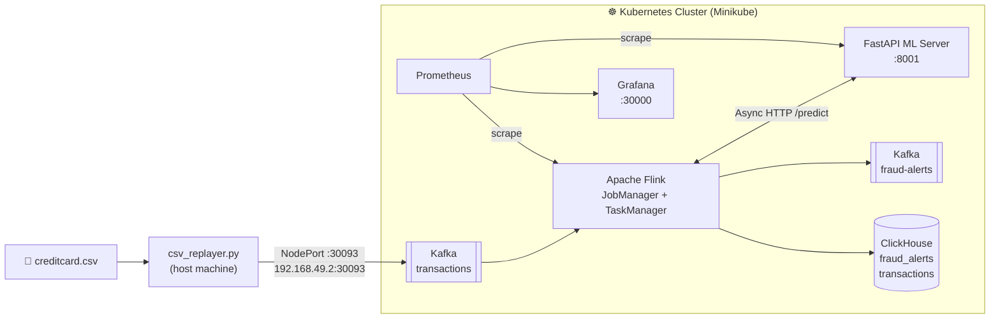

# 🛡️ Real-Time Fraud Detection Pipeline

Hệ thống phát hiện gian lận thẻ tín dụng theo **thời gian thực**, được xây dựng trên nền tảng **Apache Flink** xử lý luồng kết hợp bất đồng bộ với mô hình **XGBoost** thông qua FastAPI, toàn bộ hạ tầng chạy trên **Kubernetes (Minikube)**.

Điểm nổi bật:
- 🔁 **Async ML Inference** — Flink gọi bất đồng bộ sang FastAPI, không chặn luồng xử lý chính
- 📦 **ClickHouse** — OLAP storage cho analytics giao dịch và cảnh báo fraud
- 🔄 **Hot-swap model** — Thay mô hình ML không downtime qua HTTP API
- 📊 **Observability** — Prometheus + Grafana với drift detection tự động
- ☸️ **Kubernetes-native** — Toàn bộ hạ tầng chạy trong Minikube, truy cập qua NodePort

---

## 📐 Kiến Trúc & Luồng Dữ Liệu


```mermaid
flowchart LR
    CSV["📁 creditcard.csv"] --> REP["csv_replayer.py\n(host machine)"]
    REP -->|"NodePort :30093\n192.168.49.2:30093"| KAFKA[["Kafka\ntransactions"]]

    subgraph k8s ["☸️ Kubernetes Cluster (Minikube)"]
        KAFKA --> FLINK["Apache Flink\nJobManager + TaskManager"]
        FLINK <-->|"Async HTTP /predict"| API["FastAPI ML Server\n:8001"]

        FLINK --> KA[["Kafka\nfraud-alerts"]]
        FLINK --> CH[("ClickHouse\nfraud_alerts\ntransactions")]

        PROM["Prometheus"] -->|scrape| FLINK
        PROM -->|scrape| API
        PROM --> GRAF["Grafana\n:30000"]
    end
```

### Luồng xử lý chi tiết

| Bước | Thành phần | Mô tả |
|------|-----------|-------|
| 1 | `csv_replayer.py` | Đọc `creditcard.csv` (Kaggle), giả lập giao dịch thẻ và đẩy vào Kafka topic `transactions` qua NodePort `192.168.49.2:30093` |
| 2 | `TransactionDeserializer` | Flink deserialize JSON → `Transaction` object, đếm metric `valid_messages_total` / `malformed_messages_total` |
| 3 | `MLInferenceFunction` | Async HTTP POST `/predict` tới FastAPI, nhận `fraud_probability`. Timeout HTTP = 4s (< Flink timeout 5s) để tự phục hồi khi ML server quá tải |
| 4 | `AlertJdbcSink` | Ghi `FraudAlert` vào ClickHouse table `fraud_alerts` (batch 200 rows / 1s) |
| 5 | `TransactionJdbcSink` | Ghi mọi giao dịch vào ClickHouse table `transactions` (batch 500 rows / 1s) cho analytics |
| 6 | `KafkaSink` | Phát alert ra topic `fraud-alerts` để downstream consumer xử lý |
| 7 | Prometheus + Grafana | Scrape metrics từ Flink (`:9249`) và FastAPI (`:8001/metrics`), hiển thị trên Dashboard |

---

## 📂 Cấu Trúc Thư Mục

```text
fraud-detection-pipeline/
├── k8s/                            # Kubernetes manifests
│   ├── zookeeper.yaml              # Zookeeper (Kafka dependency)
│   ├── kafka.yaml                  # Kafka broker (internal:9092, external NodePort:30093)
│   ├── clickhouse.yaml             # ClickHouse + init schema (ConfigMap)
│   ├── flink.yaml                  # Flink JobManager + TaskManager + Services
│   ├── ml-server.yaml              # FastAPI ML server (NodePort:30001)
│   ├── prometheus.yaml             # Prometheus + scrape config (ConfigMap)
│   └── grafana.yaml                # Grafana + dashboard + datasource (nhúng trực tiếp qua ConfigMap)
│
├── ml/                             # Machine Learning module
│   ├── Dockerfile                  # Image build cho ml-server (python:3.12-slim)
│   ├── download_dataset.sh         # Tải creditcard.csv từ Kaggle
│   ├── train_model.py              # Huấn luyện XGBoost (SMOTE, IQR filter, quality gate AUROC ≥ 0.85)
│   ├── model_server.py             # FastAPI: /predict, /health, /models, /models/{v}/activate, /metrics
│   ├── requirements_ml.txt         # Python deps cho Docker image
│   ├── eda_analysis.ipynb          # Notebook phân tích dữ liệu
│   ├── models/                     # Artifacts (symlinks trỏ về version mới nhất)
│   │   ├── fraud_model.pkl         # symlink → fraud_model_<timestamp>.pkl
│   │   ├── amount_scaler.pkl       # symlink → amount_scaler_<timestamp>.pkl
│   │   ├── time_scaler.pkl         # symlink → time_scaler_<timestamp>.pkl
│   │   └── model_registry.json     # Lịch sử tất cả version (AUROC, AUPRC, trained_at)
│   └── tests/
│       └── test_model_server.py    # Pytest tests cho FastAPI server
│
├── scripts/
│   ├── create_topics.sh            # Tạo Kafka topics trong K8s
│   └── csv_replayer.py             # Giả lập giao dịch → Kafka (chạy trên host)
│
├── src/main/java/com/fraud/
│   ├── FraudDetectionJob.java      # Main Flink job: source → ML → sinks
│   ├── config/
│   │   └── PipelineConfig.java     # Đọc env vars, cung cấp defaults
│   ├── function/
│   │   └── MLInferenceFunction.java # RichAsyncFunction: HTTP pool → FastAPI
│   ├── model/
│   │   ├── Transaction.java        # POJO: id, userId, amount, mlFeatures, ...
│   │   └── FraudAlert.java         # POJO: id, severity, mlProbability, source="ML", ...
│   ├── serialization/
│   │   ├── TransactionDeserializer.java  # Kafka → Transaction + metrics
│   │   └── FraudAlertSerializer.java     # FraudAlert → Kafka bytes
│   └── sink/
│       ├── TransactionJdbcSink.java # Flink JDBC → ClickHouse transactions
│       └── AlertJdbcSink.java       # Flink JDBC → ClickHouse fraud_alerts
│
├── .env                            # Biến môi trường cục bộ (xem bảng bên dưới)
├── .env.example                    # Template để tạo .env
├── pom.xml                         # Maven: Flink 1.20, ClickHouse JDBC, Jackson, HttpClient5
└── pyproject.toml                  # Python project config (uv)
```

---

## 🛠️ Công Nghệ

| Lớp | Công nghệ | Phiên bản |
|-----|----------|----------|
| Stream Processing | Apache Flink | 1.20 (Java 17) |
| Message Broker | Apache Kafka (Confluent) | 7.6.0 |
| Message Broker Coord. | Apache ZooKeeper (Confluent) | 7.6.0 |
| OLAP Storage | ClickHouse | 24.3-alpine |
| ML Framework | XGBoost + Scikit-learn (SMOTE) | 2.1.1 / 1.5.1 |
| Model Server | FastAPI + Uvicorn | Python 3.12 |
| Observability | Prometheus + Grafana | v2.51.0 / 10.4.0 |
| Container Orchestration | Kubernetes (Minikube) | v0.0.50 |

---

## ⚙️ Yêu Cầu Cài Đặt

| Công cụ | Phiên bản | Dùng để |
|---------|----------|--------|
| [Minikube](https://minikube.sigs.k8s.io/) | ≥ 1.32 | Chạy cụm Kubernetes cục bộ |
| [kubectl](https://kubernetes.io/docs/tasks/tools/) | ≥ 1.28 | Quản lý K8s |
| Java 17 | 17 | Biên dịch Flink job |
| Maven | ≥ 3.8 | Build fat JAR |
| Python | 3.12 | Chạy replayer và ML server local |
| [uv](https://github.com/astral-sh/uv) | ≥ 0.4 | Quản lý Python environment |
| Kaggle API key | — | Tải dataset (`~/.kaggle/kaggle.json`) |

---

## 🗺️ Port Mapping

Tất cả các dịch vụ được cấu hình kiểu **NodePort** trong Kubernetes, cho phép truy cập trực tiếp từ máy host thông qua **Minikube IP** (mặc định là `192.168.49.2` hoặc có thể kiểm tra bằng lệnh `minikube ip`) mà không cần chạy bất kỳ lệnh port-forward nào:

| Dịch vụ | NodePort K8s | Đường dẫn truy cập trực tiếp từ host |
|---------|-------------|-------------------------------------|
| **Kafka (external)** | `30093` | `192.168.49.2:30093` (csv_replayer kết nối trực tiếp) |
| **ClickHouse HTTP** | `30123` | `http://192.168.49.2:30123` |
| **FastAPI ML Server**| `30001` | `http://192.168.49.2:30001` |
| **Flink Web UI** | `30081` | `http://192.168.49.2:30081` |
| **Prometheus** | `30090` | `http://192.168.49.2:30090` |
| **Grafana** | `30000` | `http://192.168.49.2:30000` (admin/fraudadmin) |

---

## 📋 Biến Môi Trường (`.env`)

| Biến | Giá trị mặc định | Mô tả |
|------|-----------------|-------|
| `KAFKA_PORT` | `30093` | Kafka NodePort |
| `KAFKA_BOOTSTRAP` | `192.168.49.2:30093` | Địa chỉ Kafka bootstrap của Minikube |
| `TRANSACTIONS_TOPIC` | `transactions` | Tên Kafka topic giao dịch |
| `CLICKHOUSE_URL` | `jdbc:clickhouse://localhost:30123/default` | JDBC URL của ClickHouse khi chạy local |
| `CLICKHOUSE_USER` | `default` | User ClickHouse |
| `CLICKHOUSE_PASSWORD` | `clickhousepass` | Password ClickHouse |
| `CHECKPOINT_STORAGE` | `file:///tmp/flink-checkpoints/` | Nơi lưu Flink checkpoints |
| `ML_THRESHOLD` | `0.5` | Ngưỡng xác suất gán nhãn FRAUD |

> **Lưu ý:** Khi chạy trên Kubernetes (Minikube), các cấu hình kết nối giữa Flink, Kafka, ClickHouse và ML Server được lấy trực tiếp từ các file YAML trong thư mục `k8s/` và Service Name nội bộ, không phụ thuộc vào file `.env` của host.

---

## 🚀 Hướng Dẫn Khởi Chạy

### Bước 0 — Chuẩn bị

```bash
# 1. Copy cấu hình môi trường
cp .env.example .env

# 2. Bật Minikube (tối thiểu 6GB RAM, 4 CPU)
minikube start --memory=6g --cpus=4

# 3. Cài Python dependencies
uv sync
```

---

### Bước 1 — Triển khai hạ tầng K8s

```bash
kubectl apply -f k8s/
```

Chờ tất cả pod sẵn sàng (khoảng 1-2 phút):

```bash
kubectl wait --for=condition=ready pod --all --timeout=120s
```

Kết quả mong đợi:

```
pod/clickhouse-xxx        condition met
pod/flink-jobmanager-xxx  condition met
pod/flink-taskmanager-xxx condition met
pod/grafana-xxx           condition met
pod/kafka-xxx             condition met
pod/ml-server-xxx         condition met
pod/prometheus-xxx        condition met
pod/zookeeper-xxx         condition met
```

---

### Bước 2 — Tạo Kafka Topics

```bash
chmod +x scripts/create_topics.sh
./scripts/create_topics.sh
```

Script sẽ tạo: `transactions` (6 partitions), `fraud-rules` (6 partitions), `fraud-alerts` (6 partitions).

---

### Bước 3 — Chuẩn bị ML Model

```bash
# Tải dataset từ Kaggle (cần ~/.kaggle/kaggle.json)
chmod +x ml/download_dataset.sh
./ml/download_dataset.sh

# Huấn luyện XGBoost (AUROC gate ≥ 0.85, ~2-3 phút)
uv run python ml/train_model.py
```

> Model sẽ được lưu vào `ml/models/` dưới dạng versioned `.pkl` + symlink `fraud_model.pkl` → version mới nhất.
> Docker image `fraud-ml-server:latest` đã **bake sẵn model** từ bước build — không cần mount volume.

**Build và load Docker image vào Minikube:**

```bash
# Trỏ Docker CLI vào Minikube's Docker daemon
eval $(minikube docker-env)

# Build image vào Minikube
docker build -f ml/Dockerfile -t fraud-ml-server:latest .

# Restart pod để lấy image mới
kubectl rollout restart deployment/ml-server
kubectl rollout status deployment/ml-server --timeout=60s
```

---

### Bước 4 — Biên dịch và Nộp Flink Job

```bash
# Build fat JAR (bỏ qua tests)
# Nếu mvn không có trong PATH, dùng đường dẫn đầy đủ:
~/apache-maven-3.9.6/bin/mvn clean package -DskipTests
# hoặc nếu mvn đã trong PATH:
# mvn clean package -DskipTests

# Lấy tên pod JobManager
JOBMANAGER_POD=$(kubectl get pods -l app=flink,component=jobmanager -o jsonpath='{.items[0].metadata.name}')
echo "JobManager: $JOBMANAGER_POD"

# (Lưu ý: Không cần chạy lệnh 'kubectl cp' vì thư mục ./target của host đã được mount tự động 
# vào /opt/flink/usrlib trong pod thông qua PersistentVolume flink-target-pvc).

# Submit job (detached mode)
kubectl exec -it $JOBMANAGER_POD -- flink run -d /opt/flink/usrlib/fraud-detection-pipeline-1.0.jar
```

Kiểm tra job đã chạy:

```bash
kubectl exec -it $JOBMANAGER_POD -- flink list
# Kết quả mong đợi: Fraud Detection Pipeline v2.0 (ML only) (RUNNING)
```

---

### Bước 5 — Xác định IP của Minikube và Truy Cập Dịch Vụ

Tất cả các dịch vụ (Grafana, Flink, Prometheus, ClickHouse) đều được mở trực tiếp dưới dạng NodePort trên địa chỉ IP của Minikube. Bạn không cần thiết lập port-forward.

Xác định IP của Minikube:
```bash
minikube ip
# Mặc định thường là 192.168.49.2
```

Sau khi có IP của Minikube, các dịch vụ có thể được truy cập trực tiếp từ máy host:
- **Grafana (Dashboard):** `http://<minikube-ip>:30000` (Ví dụ: `http://192.168.49.2:30000`)
- **Flink Web UI:** `http://<minikube-ip>:30081` (Ví dụ: `http://192.168.49.2:30081`)
- **Prometheus:** `http://<minikube-ip>:30090` (Ví dụ: `http://192.168.49.2:30090`)
- **ClickHouse (HTTP):** `http://<minikube-ip>:30123`
- **ML Server (Health):** `http://<minikube-ip>:30001/health`

---

### Bước 6 — Phát Dữ Liệu

Kafka được truy cập qua NodePort `30093` trên IP của Minikube (ví dụ: `192.168.49.2:30093`). Script phát dữ liệu sẽ tự đọc `KAFKA_BOOTSTRAP` từ file `.env`:

```bash
# Phát toàn bộ dataset (~284.807 giao dịch) ở tốc độ 5x
PYTHONPATH=. uv run python scripts/csv_replayer.py --speed 5

# Chỉ phát giao dịch fraud (492 dòng) để test phát hiện
PYTHONPATH=. uv run python scripts/csv_replayer.py --fraud-only --speed 10

# Test nhanh (200 giao dịch ở tốc độ cao)
PYTHONPATH=. uv run python scripts/csv_replayer.py --speed 200 --limit 200
```

---

## 📊 Quan Sát (Monitoring)

Khi dữ liệu bắt đầu chảy, bạn truy cập trực tiếp các Dashboard để giám sát hệ thống:

| Dashboard | URL | Credentials |
|-----------|-----|-------------|
| **Grafana** | `http://192.168.49.2:30000` hoặc `http://<minikube-ip>:30000` | admin / fraudadmin |
| **Flink Web UI** | `http://192.168.49.2:30081` hoặc `http://<minikube-ip>:30081` | — |
| **Prometheus** | `http://192.168.49.2:30090` hoặc `http://<minikube-ip>:30090` | — |
| **ML Server** | `http://192.168.49.2:30001/health` hoặc `http://<minikube-ip>:30001/health` | — |

**Kiểm tra dữ liệu trong ClickHouse:**

```bash
# Xem giao dịch gần nhất
kubectl exec -it deploy/clickhouse -- \
  clickhouse-client --password clickhousepass \
  --query "SELECT id, user_id, amount, status, event_time FROM transactions ORDER BY event_time DESC LIMIT 5;"

# Xem fraud alerts
kubectl exec -it deploy/clickhouse -- \
  clickhouse-client --password clickhousepass \
  --query "SELECT user_id, pattern_name, severity, ml_probability, detected_at FROM fraud_alerts ORDER BY detected_at DESC LIMIT 5;"

# Thống kê tổng
kubectl exec -it deploy/clickhouse -- \
  clickhouse-client --password clickhousepass \
  --query "SELECT count() as total FROM transactions UNION ALL SELECT count() FROM fraud_alerts;"
```

**Kiểm tra Kafka alerts:**

```bash
kubectl exec -it deploy/kafka -- \
  kafka-console-consumer \
  --bootstrap-server localhost:9092 \
  --topic fraud-alerts \
  --from-beginning \
  --max-messages 5
```

---

## 🔄 Hot-Swap Model (Thay Model Không Downtime)

Server ML lưu toàn bộ lịch sử phiên bản trong `ml/models/model_registry.json`.

```bash
# Xem các phiên bản đang có
curl -s http://localhost:30001/models | python3 -m json.tool

# Huấn luyện version mới
uv run python ml/train_model.py

# Kích hoạt version cụ thể (không cần restart pod)
curl -X POST http://localhost:30001/models/<version-timestamp>/activate

# Rollback về version cũ
curl -X POST http://localhost:30001/models/20260521_133240/activate

# Kiểm tra version đang active
curl -s http://localhost:30001/health
```

> **Cơ chế:** `_load_version()` dùng atomic swap (`global _state = {...}`) — GIL của Python đảm bảo an toàn luồng, không cần lock.

---

## 🧪 Kiểm Thử Tự Động

```bash
# Test FastAPI model server (cần model đã train)
PYTHONPATH=. uv run pytest ml/tests/ -v
```

---

## 🔁 Reset Toàn Bộ (Chạy Lại Từ Đầu)

Vì toàn bộ các dịch vụ được truy cập trực tiếp qua NodePort, bạn chỉ cần **1 Terminal** duy nhất để chạy toàn bộ quy trình reset và phát dữ liệu:

```bash
# 1. Xóa tất cả K8s resources cũ
kubectl delete -f k8s/

# 2. Xóa Flink checkpoints trên host (nếu có khi chạy local)
sudo rm -rf /tmp/flink-checkpoints/ 2>/dev/null || true

# 3. Triển khai lại hạ tầng
kubectl apply -f k8s/

# 4. Chờ pods sẵn sàng hoàn toàn
kubectl wait --for=condition=ready pod --all --timeout=120s

# 5. Tạo lại Kafka topics
./scripts/create_topics.sh

# 6. Submit lại Flink job (JAR tự động nhận từ thư mục ./target của host)
JOBMANAGER_POD=$(kubectl get pods -l app=flink,component=jobmanager -o jsonpath='{.items[0].metadata.name}')
kubectl exec -it $JOBMANAGER_POD -- flink run -d /opt/flink/usrlib/fraud-detection-pipeline-1.0.jar

# 7. Phát lại dữ liệu giao dịch sạch và gian lận (chạy trên cùng terminal này)
PYTHONPATH=. uv run python scripts/csv_replayer.py --speed 5
```

---

## 🛑 Tắt Hệ Thống

```bash
# Dừng tất cả K8s resources
kubectl delete -f k8s/

# (Tuỳ chọn) Dừng Minikube
minikube stop
```

---

## 🐛 Troubleshooting

| Triệu chứng | Nguyên nhân | Giải pháp |
|-------------|------------|-----------|
| `csv_replayer.py` báo `NoBrokersAvailable` | `KAFKA_BOOTSTRAP` trong `.env` sai hoặc Kafka NodePort chưa ready | Kiểm tra `nc -zv 192.168.49.2 30093` và xem log Kafka pod |
| Flink job fail ngay sau submit | JAR chưa có trong `/opt/flink/usrlib/` | Chạy lại `kubectl cp ...` rồi submit |
| ClickHouse pod crash (exit code 76) | `CLICKHOUSE_PASSWORD` trống trong `k8s/clickhouse.yaml` | Kiểm tra env vars trong manifest |
| ML server pod `CrashLoopBackOff` | Image `fraud-ml-server:latest` chưa có trong Minikube | `eval $(minikube docker-env)` rồi build lại |
| Không thấy fraud alerts trong ClickHouse | ML threshold quá cao hoặc model chưa load | Truy cập `http://192.168.49.2:30001/health` — kiểm tra `model_loaded: true` |
| Grafana hiển thị "No data" | Prometheus chưa scrape được hoặc sai khoảng thời gian | Chọn time range trên cùng bên phải Grafana thành **Last 5 minutes** |
| `rm -rf /tmp/flink-checkpoints/` báo Permission denied | Thư mục thuộc user 9999 (Flink container) | Dùng `sudo rm -rf` — checkpoint mới sẽ tự tạo khi submit job |
