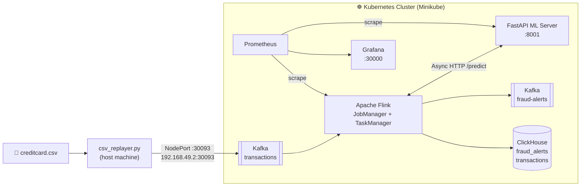

# 🛡️ Real-Time Fraud Detection Pipeline

Hệ thống phát hiện gian lận thẻ tín dụng theo **thời gian thực**, được xây dựng trên nền tảng **Apache Flink** xử lý luồng kết hợp bất đồng bộ với mô hình **XGBoost** thông qua FastAPI, toàn bộ hạ tầng chạy trên **Kubernetes (Minikube)**.

Điểm nổi bật:
- 🔁 **Async ML Inference** — Flink gọi bất đồng bộ sang FastAPI, không chặn luồng xử lý chính
- 📦 **ClickHouse** — OLAP storage cho analytics giao dịch và cảnh báo fraud
- 🔄 **Hot-swap model** — Thay mô hình ML không downtime qua HTTP API
- 📊 **Observability** — Prometheus + Grafana với drift detection tự động
- ☸️ **Kubernetes-native** — Toàn bộ hạ tầng chạy trong Minikube, truy cập qua NodePort

---

## 📐 Kiến Trúc & Luồng Dữ Liệu


```mermaid
flowchart LR
    CSV["📁 creditcard.csv"] --> REP["csv_replayer.py\n(host machine)"]
    REP -->|"NodePort :30093\n192.168.49.2:30093"| KAFKA[["Kafka\ntransactions"]]

    subgraph k8s ["☸️ Kubernetes Cluster (Minikube)"]
        KAFKA --> FLINK["Apache Flink\nJobManager + TaskManager"]
        FLINK <-->|"Async HTTP /predict"| API["FastAPI ML Server\n:8001"]

        FLINK --> KA[["Kafka\nfraud-alerts"]]
        FLINK --> CH[("ClickHouse\nfraud_alerts\ntransactions")]

        PROM["Prometheus"] -->|scrape| FLINK
        PROM -->|scrape| API
        PROM --> GRAF["Grafana\n:30000"]
    end
```

### Luồng xử lý chi tiết

| Bước | Thành phần | Mô tả |
|------|-----------|-------|
| 1 | `csv_replayer.py` | Đọc `creditcard.csv` (Kaggle), giả lập giao dịch thẻ và đẩy vào Kafka topic `transactions` qua NodePort `192.168.49.2:30093` |
| 2 | `TransactionDeserializer` | Flink deserialize JSON → `Transaction` object, đếm metric `valid_messages_total` / `malformed_messages_total` |
| 3 | `MLInferenceFunction` | Async HTTP POST `/predict` tới FastAPI, nhận `fraud_probability`. Timeout HTTP = 4s (< Flink timeout 5s) để tự phục hồi khi ML server quá tải |
| 4 | `AlertJdbcSink` | Ghi `FraudAlert` vào ClickHouse table `fraud_alerts` (batch 200 rows / 1s) |
| 5 | `TransactionJdbcSink` | Ghi mọi giao dịch vào ClickHouse table `transactions` (batch 500 rows / 1s) cho analytics |
| 6 | `KafkaSink` | Phát alert ra topic `fraud-alerts` để downstream consumer xử lý |
| 7 | Prometheus + Grafana | Scrape metrics từ Flink (`:9249`) và FastAPI (`:8001/metrics`), hiển thị trên Dashboard |

---

## 📂 Cấu Trúc Thư Mục

```text
fraud-detection-pipeline/
├── k8s/                            # Kubernetes manifests
│   ├── zookeeper.yaml              # Zookeeper (Kafka dependency)
│   ├── kafka.yaml                  # Kafka broker (internal:9092, external NodePort:30093)
│   ├── clickhouse.yaml             # ClickHouse + init schema (ConfigMap)
│   ├── flink.yaml                  # Flink JobManager + TaskManager + Services
│   ├── ml-server.yaml              # FastAPI ML server (NodePort:30001)
│   ├── prometheus.yaml             # Prometheus + scrape config (ConfigMap)
│   └── grafana.yaml                # Grafana + dashboard provisioning
│
├── ml/                             # Machine Learning module
│   ├── Dockerfile                  # Image build cho ml-server (python:3.12-slim)
│   ├── download_dataset.sh         # Tải creditcard.csv từ Kaggle
│   ├── train_model.py              # Huấn luyện XGBoost (SMOTE, IQR filter, quality gate AUROC ≥ 0.85)
│   ├── model_server.py             # FastAPI: /predict, /health, /models, /models/{v}/activate, /metrics
│   ├── requirements_ml.txt         # Python deps cho Docker image
│   ├── eda_analysis.ipynb          # Notebook phân tích dữ liệu
│   ├── models/                     # Artifacts (symlinks trỏ về version mới nhất)
│   │   ├── fraud_model.pkl         # symlink → fraud_model_<timestamp>.pkl
│   │   ├── amount_scaler.pkl       # symlink → amount_scaler_<timestamp>.pkl
│   │   ├── time_scaler.pkl         # symlink → time_scaler_<timestamp>.pkl
│   │   └── model_registry.json     # Lịch sử tất cả version (AUROC, AUPRC, trained_at)
│   └── tests/
│       └── test_model_server.py    # Pytest tests cho FastAPI server
│
├── monitoring/
│   ├── prometheus.yml              # Tham khảo local (config thực tế trong k8s/prometheus.yaml)
│   └── grafana/
│       ├── provisioning/           # Tự động cấu hình datasource Prometheus
│       └── dashboards/
│           └── fraud_pipeline.json # Dashboard: throughput, latency, fraud rate, model drift
│
├── scripts/
│   ├── create_topics.sh            # Tạo Kafka topics trong K8s
│   ├── csv_replayer.py             # Giả lập giao dịch → Kafka (chạy trên host)
│   └── port_forward.sh             # kubectl port-forward Grafana/Prometheus/Flink/ClickHouse/ML
│
├── src/main/java/com/fraud/
│   ├── FraudDetectionJob.java      # Main Flink job: source → ML → sinks
│   ├── config/
│   │   └── PipelineConfig.java     # Đọc env vars, cung cấp defaults
│   ├── function/
│   │   └── MLInferenceFunction.java # RichAsyncFunction: HTTP pool → FastAPI
│   ├── model/
│   │   ├── Transaction.java        # POJO: id, userId, amount, mlFeatures, ...
│   │   └── FraudAlert.java         # POJO: id, severity, mlProbability, source="ML", ...
│   ├── serialization/
│   │   ├── TransactionDeserializer.java  # Kafka → Transaction + metrics
│   │   └── FraudAlertSerializer.java     # FraudAlert → Kafka bytes
│   └── sink/
│       ├── TransactionJdbcSink.java # Flink JDBC → ClickHouse transactions
│       └── AlertJdbcSink.java       # Flink JDBC → ClickHouse fraud_alerts
│
├── .env                            # Biến môi trường cục bộ (xem bảng bên dưới)
├── .env.example                    # Template để tạo .env
├── pom.xml                         # Maven: Flink 1.20, ClickHouse JDBC, Jackson, HttpClient5
└── pyproject.toml                  # Python project config (uv)
```

---

## 🛠️ Công Nghệ

| Lớp | Công nghệ | Phiên bản |
|-----|----------|----------|
| Stream Processing | Apache Flink | 1.20 (Java 17) |
| Message Broker | Apache Kafka (Confluent) | 7.6.0 |
| Message Broker Coord. | Apache ZooKeeper (Confluent) | 7.6.0 |
| OLAP Storage | ClickHouse | 24.3-alpine |
| ML Framework | XGBoost + Scikit-learn (SMOTE) | 2.1.1 / 1.5.1 |
| Model Server | FastAPI + Uvicorn | Python 3.12 |
| Observability | Prometheus + Grafana | v2.51.0 / 10.4.0 |
| Container Orchestration | Kubernetes (Minikube) | v0.0.50 |

---

## ⚙️ Yêu Cầu Cài Đặt

| Công cụ | Phiên bản | Dùng để |
|---------|----------|--------|
| [Minikube](https://minikube.sigs.k8s.io/) | ≥ 1.32 | Chạy cụm Kubernetes cục bộ |
| [kubectl](https://kubernetes.io/docs/tasks/tools/) | ≥ 1.28 | Quản lý K8s |
| Java 17 | 17 | Biên dịch Flink job |
| Maven | ≥ 3.8 | Build fat JAR |
| Python | 3.12 | Chạy replayer và ML server local |
| [uv](https://github.com/astral-sh/uv) | ≥ 0.4 | Quản lý Python environment |
| Kaggle API key | — | Tải dataset (`~/.kaggle/kaggle.json`) |

---

## 🗺️ Port Mapping

Tất cả services sử dụng **NodePort** — truy cập trực tiếp qua `minikube ip` mà không cần port-forward (ngoại trừ Grafana/Prometheus/Flink/ClickHouse/ML Server được port-forward về localhost cho tiện).

| Port | Dịch vụ | NodePort K8s | Truy cập từ host |
|------|---------|-------------|-----------------|
| `9092` | Kafka (internal K8s) | — | Chỉ dùng nội bộ trong cluster |
| `30093` | Kafka (external) | `30093` | `192.168.49.2:30093` — csv_replayer kết nối trực tiếp |
| `30123` | ClickHouse HTTP | `30123` | `http://localhost:30123` (qua port-forward) |
| `30900` | ClickHouse Native | `30900` | Native TCP protocol |
| `30001` | FastAPI ML Server | `30001` | `http://localhost:30001` (qua port-forward) |
| `30081` | Flink Web UI | `30081` | `http://localhost:30081` (qua port-forward) |
| `30090` | Prometheus | `30090` | `http://localhost:30090` (qua port-forward) |
| `30000` | Grafana | `30000` | `http://localhost:30000` (qua port-forward) |

---

## 📋 Biến Môi Trường (`.env`)

| Biến | Giá trị mặc định | Ai đọc | Mô tả |
|------|-----------------|--------|-------|
| `GRAFANA_PORT` | `30000` | `port_forward.sh` | Port forward Grafana ra host (= NodePort) |
| `PROMETHEUS_PORT` | `30090` | `port_forward.sh` | Port forward Prometheus ra host (= NodePort) |
| `FLINK_WEB_PORT` | `30081` | `port_forward.sh` | Port forward Flink UI ra host (= NodePort) |
| `CLICKHOUSE_PORT` | `30123` | `port_forward.sh` | Port forward ClickHouse HTTP ra host (= NodePort) |
| `MODEL_SERVER_PORT` | `30001` | `port_forward.sh`, `model_server.py` | Port forward ML Server ra host (= NodePort) |
| `KAFKA_PORT` | `30093` | `csv_replayer.py` | Kafka NodePort — csv_replayer kết nối trực tiếp, không cần port-forward |
| `KAFKA_BOOTSTRAP` | `192.168.49.2:30093` | `csv_replayer.py` | Kafka bootstrap address đầy đủ (minikube ip:NodePort) |
| `TRANSACTIONS_TOPIC` | `transactions` | `csv_replayer.py` | Tên Kafka topic giao dịch |
| `CLICKHOUSE_URL` | `jdbc:clickhouse://localhost:30123/default` | `PipelineConfig.java` (chạy local) | JDBC URL ClickHouse |
| `CLICKHOUSE_USER` | `default` | `PipelineConfig.java` (chạy local) | User ClickHouse |
| `CLICKHOUSE_PASSWORD` | `clickhousepass` | `PipelineConfig.java` (chạy local) | Password ClickHouse |
| `CHECKPOINT_STORAGE` | `file:///tmp/flink-checkpoints/...` | `PipelineConfig.java` (chạy local) | Nơi lưu Flink checkpoints |
| `ML_THRESHOLD` | `0.5` | `model_server.py` | Ngưỡng xác suất để gán nhãn FRAUD |

> **Lưu ý:** Khi Flink chạy trong K8s, các biến `CLICKHOUSE_*` được inject trực tiếp từ `k8s/flink.yaml` — file `.env` không có hiệu lực với các pod K8s.

---

## 🚀 Hướng Dẫn Khởi Chạy

### Bước 0 — Chuẩn bị

```bash
# 1. Copy cấu hình môi trường
cp .env.example .env

# 2. Bật Minikube (tối thiểu 6GB RAM, 4 CPU)
minikube start --memory=6g --cpus=4

# 3. Cài Python dependencies
uv sync
```

---

### Bước 1 — Triển khai hạ tầng K8s

```bash
kubectl apply -f k8s/
```

Chờ tất cả pod sẵn sàng (khoảng 1-2 phút):

```bash
kubectl wait --for=condition=ready pod --all --timeout=120s
```

Kết quả mong đợi:

```
pod/clickhouse-xxx        condition met
pod/flink-jobmanager-xxx  condition met
pod/flink-taskmanager-xxx condition met
pod/grafana-xxx           condition met
pod/kafka-xxx             condition met
pod/ml-server-xxx         condition met
pod/prometheus-xxx        condition met
pod/zookeeper-xxx         condition met
```

---

### Bước 2 — Tạo Kafka Topics

```bash
chmod +x scripts/create_topics.sh
./scripts/create_topics.sh
```

Script sẽ tạo: `transactions` (6 partitions), `fraud-rules` (6 partitions), `fraud-alerts` (6 partitions).

---

### Bước 3 — Chuẩn bị ML Model

```bash
# Tải dataset từ Kaggle (cần ~/.kaggle/kaggle.json)
chmod +x ml/download_dataset.sh
./ml/download_dataset.sh

# Huấn luyện XGBoost (AUROC gate ≥ 0.85, ~2-3 phút)
uv run python ml/train_model.py
```

> Model sẽ được lưu vào `ml/models/` dưới dạng versioned `.pkl` + symlink `fraud_model.pkl` → version mới nhất.
> Docker image `fraud-ml-server:latest` đã **bake sẵn model** từ bước build — không cần mount volume.

**Build và load Docker image vào Minikube:**

```bash
# Trỏ Docker CLI vào Minikube's Docker daemon
eval $(minikube docker-env)

# Build image vào Minikube
docker build -f ml/Dockerfile -t fraud-ml-server:latest .

# Restart pod để lấy image mới
kubectl rollout restart deployment/ml-server
kubectl rollout status deployment/ml-server --timeout=60s
```

---

### Bước 4 — Biên dịch và Nộp Flink Job

```bash
# Build fat JAR (bỏ qua tests)
# Nếu mvn không có trong PATH, dùng đường dẫn đầy đủ:
~/apache-maven-3.9.6/bin/mvn clean package -DskipTests
# hoặc nếu mvn đã trong PATH:
# mvn clean package -DskipTests

# Lấy tên pod JobManager
JOBMANAGER_POD=$(kubectl get pods -l app=flink,component=jobmanager -o jsonpath='{.items[0].metadata.name}')
echo "JobManager: $JOBMANAGER_POD"

# Copy JAR vào pod
kubectl cp target/fraud-detection-pipeline-1.0.jar $JOBMANAGER_POD:/opt/flink/usrlib/

# Submit job (detached mode)
kubectl exec -it $JOBMANAGER_POD -- flink run -d /opt/flink/usrlib/fraud-detection-pipeline-1.0.jar
```

Kiểm tra job đã chạy:

```bash
kubectl exec -it $JOBMANAGER_POD -- flink list
# Kết quả mong đợi: Fraud Detection Pipeline v2.0 (ML only) (RUNNING)
```

---

### Bước 5 — Mở Port Forwards

Kafka kết nối trực tiếp qua NodePort — **không cần port-forward cho Kafka**. Chỉ cần port-forward các service có dashboard web:

```bash
# Chạy trong terminal riêng và giữ terminal đó mở
./scripts/port_forward.sh
```

Sau khi chạy xong, truy cập được:
- Grafana: `http://localhost:30000`
- Prometheus: `http://localhost:30090`
- Flink UI: `http://localhost:30081`
- ClickHouse: `http://localhost:30123`
- ML Server: `http://localhost:30001`

---

### Bước 6 — Phát Dữ Liệu

Kafka được truy cập qua NodePort `192.168.49.2:30093` — script tự đọc `KAFKA_BOOTSTRAP` từ `.env`:

```bash
# Phát toàn bộ dataset (~284.807 giao dịch) ở tốc độ 5x
PYTHONPATH=. uv run python scripts/csv_replayer.py --speed 5

# Chỉ phát giao dịch fraud (492 dòng) để test phát hiện
PYTHONPATH=. uv run python scripts/csv_replayer.py --fraud-only --speed 10

# Test nhanh (200 giao dịch ở tốc độ cao)
PYTHONPATH=. uv run python scripts/csv_replayer.py --speed 200 --limit 200
```

---

## 📊 Quan Sát (Monitoring)

Sau khi dữ liệu bắt đầu chảy (cần chạy `port_forward.sh` trước):

| Dashboard | URL | Credentials |
|-----------|-----|-------------|
| Grafana | `http://localhost:30000` | admin / fraudadmin |
| Prometheus | `http://localhost:30090` | — |
| Flink Web UI | `http://localhost:30081` | — |
| ML Server | `http://localhost:30001/health` | — |

> Hoặc truy cập trực tiếp qua NodePort (không cần port-forward): `http://$(minikube ip):30000`

**Kiểm tra dữ liệu trong ClickHouse:**

```bash
# Xem giao dịch gần nhất
kubectl exec -it deploy/clickhouse -- \
  clickhouse-client --password clickhousepass \
  --query "SELECT id, user_id, amount, status, event_time FROM transactions ORDER BY event_time DESC LIMIT 5;"

# Xem fraud alerts
kubectl exec -it deploy/clickhouse -- \
  clickhouse-client --password clickhousepass \
  --query "SELECT user_id, pattern_name, severity, ml_probability, detected_at FROM fraud_alerts ORDER BY detected_at DESC LIMIT 5;"

# Thống kê tổng
kubectl exec -it deploy/clickhouse -- \
  clickhouse-client --password clickhousepass \
  --query "SELECT count() as total FROM transactions UNION ALL SELECT count() FROM fraud_alerts;"
```

**Kiểm tra Kafka alerts:**

```bash
kubectl exec -it deploy/kafka -- \
  kafka-console-consumer \
  --bootstrap-server localhost:9092 \
  --topic fraud-alerts \
  --from-beginning \
  --max-messages 5
```

---

## 🔄 Hot-Swap Model (Thay Model Không Downtime)

Server ML lưu toàn bộ lịch sử phiên bản trong `ml/models/model_registry.json`.

```bash
# Xem các phiên bản đang có
curl -s http://localhost:30001/models | python3 -m json.tool

# Huấn luyện version mới
uv run python ml/train_model.py

# Kích hoạt version cụ thể (không cần restart pod)
curl -X POST http://localhost:30001/models/<version-timestamp>/activate

# Rollback về version cũ
curl -X POST http://localhost:30001/models/20260521_133240/activate

# Kiểm tra version đang active
curl -s http://localhost:30001/health
```

> **Cơ chế:** `_load_version()` dùng atomic swap (`global _state = {...}`) — GIL của Python đảm bảo an toàn luồng, không cần lock.

---

## 🧪 Kiểm Thử Tự Động

```bash
# Test FastAPI model server (cần model đã train)
PYTHONPATH=. uv run pytest ml/tests/ -v
```

---

## 🔁 Reset Toàn Bộ (Chạy Lại Từ Đầu)

```bash
# 1. Xóa tất cả K8s resources
kubectl delete -f k8s/

# 2. Xóa Flink checkpoints trên host
# (thư mục thuộc root vì Flink chạy trong container — dùng sudo)
sudo rm -rf /tmp/flink-checkpoints/ 2>/dev/null || true

# 3. Triển khai lại
kubectl apply -f k8s/

# 4. Chờ pods sẵn sàng
kubectl wait --for=condition=ready pod --all --timeout=120s

# 5. Tạo lại Kafka topics
./scripts/create_topics.sh

# 6. Submit lại Flink job (JAR đã có sẵn trong pod từ lần trước qua PVC)
JOBMANAGER_POD=$(kubectl get pods -l app=flink,component=jobmanager -o jsonpath='{.items[0].metadata.name}')
kubectl exec -it $JOBMANAGER_POD -- flink run -d /opt/flink/usrlib/fraud-detection-pipeline-1.0.jar

# 7. Mở port-forwards (terminal riêng)
./scripts/port_forward.sh
```

---

## 🛑 Tắt Hệ Thống

```bash
# Dừng tất cả K8s resources
kubectl delete -f k8s/

# (Tuỳ chọn) Dừng Minikube
minikube stop
```

---

## 🐛 Troubleshooting

| Triệu chứng | Nguyên nhân | Giải pháp |
|-------------|------------|-----------|
| `csv_replayer.py` báo `NoBrokersAvailable` | `KAFKA_BOOTSTRAP` trong `.env` sai hoặc Kafka NodePort chưa ready | Kiểm tra `nc -zv 192.168.49.2 30093` và xem log Kafka pod |
| Flink job fail ngay sau submit | JAR chưa có trong `/opt/flink/usrlib/` | Chạy lại `kubectl cp ...` rồi submit |
| ClickHouse pod crash (exit code 76) | `CLICKHOUSE_PASSWORD` trống trong `k8s/clickhouse.yaml` | Kiểm tra env vars trong manifest |
| ML server pod `CrashLoopBackOff` | Image `fraud-ml-server:latest` chưa có trong Minikube | `eval $(minikube docker-env)` rồi build lại |
| Không thấy fraud alerts trong ClickHouse | ML threshold quá cao hoặc model chưa load | `curl localhost:30001/health` — kiểm tra `model_loaded: true` |
| Grafana hiển thị "No data" | Prometheus chưa scrape được | Kiểm tra `Status > Targets` tại `http://localhost:30090` |
| `port_forward.sh` drop kết nối | Script bị kill khi đóng terminal | Chạy script trong terminal riêng và giữ mở; không dùng `&` trong background |
| `rm -rf /tmp/flink-checkpoints/` báo Permission denied | Thư mục thuộc user 9999 (Flink container) | Dùng `sudo rm -rf` — checkpoint mới sẽ tự tạo khi submit job |
