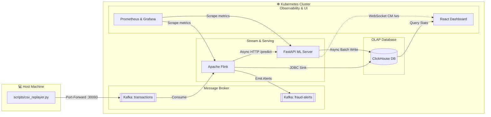

# 🛡️ Real-Time Fraud Detection Pipeline

Hệ thống phát hiện gian lận thẻ tín dụng theo **thời gian thực**, được xây dựng trên nền tảng **Apache Flink** xử lý luồng kết hợp bất đồng bộ với mô hình **XGBoost** thông qua FastAPI, toàn bộ hạ tầng chạy trên **Kubernetes (Minikube)**.

Điểm nổi bật:
- 🔁 **Async ML Inference** — Flink gọi bất đồng bộ sang FastAPI, không chặn luồng xử lý chính
- 📦 **ClickHouse** — OLAP storage cho analytics giao dịch và cảnh báo fraud
- 🔄 **Hot-swap model** — Thay mô hình ML không downtime qua HTTP API
- 📊 **Observability** — Prometheus + Grafana với drift detection tự động
- ☸️ **Kubernetes-native** — Toàn bộ hạ tầng chạy trong Minikube, truy cập thông qua Port-Forward (ClusterIP)

---

## Nguồn Dữ Liệu

Dự án sử dụng dataset Kaggle [`mlg-ulb/creditcardfraud`](https://www.kaggle.com/datasets/mlg-ulb/creditcardfraud), được tải bằng `ml/download_dataset.sh` vào `ml/data/creditcard.csv`.

Ý nghĩa các trường chính:
- `Time`: số giây kể từ giao dịch đầu tiên trong dataset, không phải timestamp tuyệt đối.
- `V1` đến `V28`: PCA-anonymized features do dataset cung cấp.
- `Amount`: số tiền giao dịch.
- `Class`: ground-truth label, `1` là fraud và `0` là legitimate.

Trong pipeline demo, `scripts/csv_replayer.py` map `Time` thành `eventTime` thực bằng cách lấy `base_ts + Time`, và map `Class` thành `status` để ghi vào bảng `ground_truth`. `status/Class/rawLabel` không được gửi vào model inference. Transaction id được sinh deterministic theo dòng dataset và `--run-id`; replay cùng `run-id` giúp ClickHouse deduplicate, còn đổi `--run-id` sẽ tạo một luồng giao dịch mới. `run_id` và `data_source` được lưu xuyên suốt trong `transactions`, `ground_truth`, `model_predictions` và `fraud_alerts` để audit từng lần replay.

---

## 📐 Kiến Trúc & Luồng Dữ Liệu


```mermaid
flowchart LR
    subgraph Host ["💻 Host Machine"]
        REP["scripts/csv_replayer.py"]
    end

    subgraph Cluster ["☸️ Kubernetes Cluster"]
        subgraph Broker ["Message Broker"]
            K_TXN[["Kafka: transactions"]]
            K_ALT[["Kafka: fraud-alerts"]]
        end

        subgraph Processing ["Stream & Serving"]
            FLINK["Apache Flink"]
            API["FastAPI ML Server"]
        end

        subgraph DB ["OLAP Database"]
            CH[("ClickHouse DB")]
        end

        subgraph UI ["Observability & UI"]
            DASH["React Dashboard"]
            MONITOR["Prometheus & Grafana"]
        end
    end

    %% Core Data Flow
    REP -->|"Port-Forward :30093"| K_TXN
    K_TXN -->|Consume| FLINK
    FLINK -->|Async HTTP /predict| API
    %% Storage & Output Flow
    FLINK -->|JDBC Sink| CH
    API -->|Async Batch Write| CH
    FLINK -->|Emit Alerts| K_ALT

    %% UI & Metrics Flow
    CH -->|Query Stats| DASH
    API -.->|WebSocket CM /ws| DASH
    MONITOR -->|Scrape metrics| API
    MONITOR -->|Scrape metrics| FLINK
```

### Luồng xử lý chi tiết

| Bước | Thành phần | Mô tả |
|------|-----------|-------|
| 1 | `csv_replayer.py` | Đọc `creditcard.csv` (Kaggle), giả lập giao dịch thẻ và đẩy vào Kafka topic `transactions` qua port-forward `localhost:30093` |
| 2 | `TransactionDeserializer` | Flink deserialize JSON → `Transaction` object, đếm metric `valid_messages_total` / `malformed_messages_total` |
| 3 | `MLInferenceFunction` | Gọi bất đồng bộ (Async HTTP POST) `/predict` sang FastAPI để lấy kết quả xác suất và quyết định gán nhãn `is_fraud` |
| 4 | ClickHouse Logging | FastAPI đẩy kết quả dự đoán vào Async Queue và ghi nhận bất đồng bộ theo lô (Async Batch Writer) vào bảng ClickHouse `default.model_predictions` |
| 5 | JDBC Sinks (Flink) | Ba sink chạy song song: `TransactionJdbcSink` ghi dữ liệu giao dịch (không có label) vào `default.transactions` (batch 500, interval 1s); `AlertJdbcSink` ghi cảnh báo vào `default.fraud_alerts` (batch 200, interval 1s); `GroundTruthJdbcSink` ghi nhãn ground-truth vào `default.ground_truth` (tách biệt với inference) |
| 6 | Kafka Alert Sink | Flink đẩy cảnh báo phát hiện gian lận ra topic `fraud-alerts` cho các ứng dụng tiêu thụ kế tiếp |
| 7 | WebSocket & Dashboard | FastAPI serve ứng dụng React tĩnh tại `/` và đẩy các chỉ số Confusion Matrix (Accuracy, Precision, Recall, F1) qua WebSocket `/ws` mỗi 2 giây — tính bằng cách JOIN `model_predictions` với `ground_truth` (không dùng `transactions.status`), giới hạn 24h gần nhất, cache 5 giây để giảm tải ClickHouse |
| 8 | Prometheus + Grafana | Scrape metrics từ **FastAPI** (`ml-server-service:8001/metrics`) và **Flink JobManager + TaskManager** (`flink-jobmanager-service:9249`, `flink-taskmanager-service:9249`); Grafana hiển thị feature drift, latency, alert rates từ Prometheus |

---

## 📂 Cấu Trúc Thư Mục

```text
fraud-detection-pipeline/
├── k8s/                            # Kubernetes manifests
│   ├── zookeeper.yaml              # Zookeeper (Kafka dependency)
│   ├── kafka.yaml                  # Kafka broker (internal:9092, Port-Forward:30093)
│   ├── secrets.yaml.example        # Template để tạo Secrets (ClickHouse, Grafana, ML admin)
│   ├── secrets.yaml                # Cấu hình Secrets thực tế 
│   ├── clickhouse.yaml             # ClickHouse + init schema (Bảng transactions, fraud_alerts, model_predictions)
│   ├── flink.yaml                  # Flink JobManager + TaskManager + Services
│   ├── ml-server.yaml              # FastAPI ML server (Port-Forward:30001)
│   ├── prometheus.yaml             # Prometheus + scrape config (ConfigMap)
│   └── grafana.yaml                # Grafana + dashboard + datasource (nhúng trực tiếp qua ConfigMap)
│
├── ml/                             # Machine Learning module
│   ├── Dockerfile                  # Image build cho ml-server (python:3.12-slim)
│   ├── download_dataset.sh         # Tải creditcard.csv từ Kaggle
│   ├── train_model.py              # Huấn luyện XGBoost (BorderlineSMOTE, threshold tối ưu trên val set, quality gate AUPRC ≥ 0.80, giữ tối đa 3 versions)
│   ├── model_server.py             # FastAPI: /predict, /health, /models, /models/{v}/activate, /api/predictions, /ws
│   ├── requirements_ml.txt         # Python deps cho Docker image (FastAPI, websockets, scikit-learn, ...)
│   ├── eda_analysis.ipynb          # Notebook phân tích dữ liệu
│   ├── dashboard/                  # Mã nguồn ứng dụng frontend React + Vite Dashboard
│   ├── static/                     # Gói tĩnh React SPA đã được compile (FastAPI serve tại root /)
│   ├── models/                     # Artifacts (symlinks trỏ về version mới nhất)
│   │   ├── fraud_model.pkl         # symlink → fraud_model_<timestamp>.pkl
│   │   ├── amount_scaler.pkl       # symlink → amount_scaler_<timestamp>.pkl
│   │   ├── time_scaler.pkl         # symlink → time_scaler_<timestamp>.pkl
│   │   ├── baseline_stats.json     # symlink → baseline_stats_<timestamp>.json (baseline để giám sát feature drift)
│   │   └── model_registry.json     # Lịch sử version (algorithm, AUROC, AUPRC, threshold, trained_at)
│   └── tests/
│       └── test_model_server.py    # Pytest tests cho FastAPI server (định dạng PredictRequest mới)
│
├── scripts/
│   ├── create_topics.sh            # Tạo Kafka topics trong K8s
│   ├── csv_replayer.py             # Giả lập giao dịch → Kafka (chạy trên host)
│   └── port_forward.sh             # Thiết lập chuyển tiếp cổng cho các dịch vụ K8s về localhost
│
├── src/main/java/com/fraud/
│   ├── FraudDetectionJob.java      # Main Flink job: source → ML → sinks
│   ├── config/
│   │   └── PipelineConfig.java     # Đọc env vars, cung cấp defaults
│   ├── function/
│   │   └── MLInferenceFunction.java # RichAsyncFunction: HTTP pool → FastAPI (đồng bộ is_fraud nhãn từ ML Server)
│   ├── model/
│   │   ├── Transaction.java        # POJO: id, amount, status, eventTime, mlFeatures
│   │   └── FraudAlert.java         # POJO: id, severity, mlProbability, source="ML", ...
│   ├── serialization/
│   │   ├── TransactionDeserializer.java  # Kafka → Transaction + metrics
│   │   └── FraudAlertSerializer.java     # FraudAlert → Kafka bytes
│   └── sink/
│       ├── TransactionJdbcSink.java  # Flink JDBC → ClickHouse transactions
│       ├── AlertJdbcSink.java        # Flink JDBC → ClickHouse fraud_alerts
│       └── GroundTruthJdbcSink.java  # Flink JDBC → ClickHouse ground_truth
│
├── .env                            # Biến môi trường cục bộ 
├── .env.example                    # Template để tạo .env
├── pom.xml                         # Maven: Flink 1.20, ClickHouse JDBC, Jackson, HttpClient5
└── pyproject.toml                  # Python project config (uv)
```

---

## 🛠️ Công Nghệ

| Lớp | Công nghệ | Phiên bản |
|-----|----------|----------|
| Stream Processing | Apache Flink | 1.20 (Java 17) |
| Message Broker | Apache Kafka (Confluent) | 7.6.0 |
| Message Broker Coord. | Apache ZooKeeper (Confluent) | 7.6.0 |
| OLAP Storage | ClickHouse | 24.3-alpine |
| ML Framework | XGBoost + Scikit-learn (BorderlineSMOTE) | 2.1+ / 1.5+ |
| Model Server | FastAPI + Uvicorn | Python 3.12 |
| Observability | Prometheus + Grafana | v2.51.0 / 10.4.0 |
| Container Orchestration | Kubernetes (Minikube) | v0.0.50 |

---

## ⚙️ Yêu Cầu Cài Đặt

| Công cụ | Phiên bản | Dùng để |
|---------|----------|--------|
| [Minikube](https://minikube.sigs.k8s.io/) | ≥ 1.32 | Chạy cụm Kubernetes cục bộ |
| [kubectl](https://kubernetes.io/docs/tasks/tools/) | ≥ 1.28 | Quản lý K8s |
| Java 17 | 17 | Biên dịch Flink job |
| Maven | ≥ 3.8 | Build fat JAR |
| Python | 3.12 | Chạy replayer và ML server local |
| [uv](https://github.com/astral-sh/uv) | ≥ 0.4 | Quản lý Python environment |
| Kaggle API key | — | Tải dataset (`~/.kaggle/kaggle.json`) |

---

## 🗺️ Port Mapping

Tất cả các dịch vụ được cấu hình kiểu **ClusterIP** trong Kubernetes để tránh xung đột cổng khi chạy nhiều dự án. Bạn sẽ truy cập các dịch vụ từ máy host thông qua cổng **localhost** sau khi chạy script port-forward:

| Dịch vụ | Cổng Localhost | Đường dẫn truy cập từ host |
|---------|----------------|----------------------------|
| **Kafka (external)** | `30093` | `localhost:30093`  |
| **ClickHouse HTTP** | `30123` | `http://localhost:30123` |
| **FastAPI ML Server**| `30001` | `http://localhost:30001` |
| **Flink Web UI** | `30081` | `http://localhost:30081` |
| **Prometheus** | `30090` | `http://localhost:30090` |
| **Grafana** | `30000` | `http://localhost:30000` |

---

## 📋 Biến Môi Trường (`.env`)

| Biến | Giá trị mặc định | Mô tả |
|------|-----------------|-------|
| `GRAFANA_PORT` | `30000` | Cổng ánh xạ Grafana về localhost |
| `PROMETHEUS_PORT` | `30090` | Cổng ánh xạ Prometheus về localhost |
| `FLINK_WEB_PORT` | `30081` | Cổng ánh xạ Flink Web UI về localhost |
| `CLICKHOUSE_PORT` | `30123` | Cổng ánh xạ ClickHouse HTTP về localhost |
| `MODEL_SERVER_PORT` | `30001` | Cổng ánh xạ ML Server về localhost |
| `KAFKA_PORT` | `30093` | Cổng ánh xạ Kafka về localhost |
| `KAFKA_BOOTSTRAP` | `localhost:30093` | Địa chỉ kết nối Kafka dành cho máy host |
| `TRANSACTIONS_TOPIC` | `transactions` | Tên Kafka topic giao dịch |
| `CLICKHOUSE_URL` | `jdbc:clickhouse://localhost:30123/default` | JDBC URL của ClickHouse khi chạy local |
| `CLICKHOUSE_USER` | `default` | User ClickHouse |
| `CLICKHOUSE_PASSWORD` | `<your_secure_password_here>` | Password ClickHouse |
| `CHECKPOINT_STORAGE` | `file:///flink-checkpoints/fraud-pipeline` | Nơi lưu Flink checkpoints |
| `ML_THRESHOLD` | `0.5` | Fallback threshold cho model registry cũ chưa có threshold |
| `MODEL_ADMIN_API_KEY` | `<your_model_admin_api_key_here>` | API key cho endpoint quản trị model khi chạy local |
| `PREDICTION_DLQ_DIR` | `ml/dlq` | Thư mục lưu batch prediction lỗi khi ClickHouse không ghi được |

> **Lưu ý:** Khi chạy trên Kubernetes (Minikube), cấu hình kết nối giữa Flink, Kafka, ClickHouse và ML Server sử dụng địa chỉ mạng dịch vụ nội bộ (ví dụ: `kafka-service:9092`), độc lập với cổng ánh xạ port-forward bên ngoài.

---

## 🚀 Hướng Dẫn Khởi Chạy

### Bước 0 — Chuẩn bị

```bash
# 1. Copy cấu hình môi trường và K8s Secrets
cp .env.example .env
cp k8s/secrets.yaml.example k8s/secrets.yaml

# 2. Bật Minikube (tối thiểu 6GB RAM, 4 CPU)
minikube start --memory=6g --cpus=4

# 3. Cài Python dependencies
uv sync
```

---

### Bước 1 — Triển khai hạ tầng K8s

```bash
kubectl apply -f k8s/
```

Chờ tất cả pod sẵn sàng (khoảng 1-2 phút):

```bash
kubectl wait --for=condition=ready pod --all --timeout=120s
```

Kết quả mong đợi:

```
pod/clickhouse-xxx        condition met
pod/flink-jobmanager-xxx  condition met
pod/flink-taskmanager-xxx condition met
pod/grafana-xxx           condition met
pod/kafka-xxx             condition met
pod/ml-server-xxx         condition met
pod/prometheus-xxx        condition met
pod/zookeeper-xxx         condition met
```

---

### Bước 2 — Tạo Kafka Topics

```bash
chmod +x scripts/create_topics.sh
./scripts/create_topics.sh
```

Script sẽ tạo: `transactions` (6 partitions) và `fraud-alerts` (6 partitions).

---

### Bước 3 — Chuẩn bị ML Model

```bash
# Tải dataset từ Kaggle
# *Lưu ý*: Yêu cầu cài thư viện kaggle (pip install kaggle) và đặt token kaggle.json tải từ Kaggle vào thư mục ~/.kaggle/ (Linux/macOS) hoặc %USERPROFILE%\.kaggle\ (Windows) với quyền đọc thích hợp (chmod 600)
chmod +x ml/download_dataset.sh
./ml/download_dataset.sh

# Huấn luyện và chọn model tốt nhất theo AUPRC.
# Threshold được chọn trên validation set; test set chỉ dùng để đánh giá cuối.
uv run python ml/train_model.py

# Sau khi train, model tự động lưu vào ml/models/ và cập nhật model_registry.json
# Chỉ giữ lại 3 versions gần nhất, các version cũ sẽ bị xóa tự động
```

> Model sẽ được lưu vào `ml/models/` dưới dạng versioned `.pkl` + symlink `fraud_model.pkl` → version mới nhất. Docker image `fraud-ml-server:latest` copy `ml/` tại thời điểm build, vì vậy hãy build image sau khi train model. Với production hoặc nhiều replica, nên thay bằng MLflow/MinIO/S3/PVC shared model registry.

**Build và load Docker image vào Minikube:**

```bash
# Trỏ Docker CLI vào Minikube's Docker daemon
eval $(minikube docker-env)

# Build image vào Minikube
docker build -f ml/Dockerfile -t fraud-ml-server:latest .

# Restart pod để lấy image mới
kubectl rollout restart deployment/ml-server
kubectl rollout status deployment/ml-server --timeout=60s
```

---

### Bước 4 — Biên dịch và Nộp Flink Job

```bash
# Build fat JAR (bỏ qua tests)
# Nếu mvn không có trong PATH, dùng đường dẫn đầy đủ:
~/apache-maven-3.9.6/bin/mvn clean package -DskipTests
# hoặc nếu mvn đã trong PATH:
# mvn clean package -DskipTests

# Lấy tên pod JobManager và TaskManager
JOBMANAGER_POD=$(kubectl get pods -l app=flink,component=jobmanager -o jsonpath='{.items[0].metadata.name}')
TASKMANAGER_POD=$(kubectl get pods -l app=flink,component=taskmanager -o jsonpath='{.items[0].metadata.name}')
echo "JobManager: $JOBMANAGER_POD"
echo "TaskManager: $TASKMANAGER_POD"

# Copy file JAR từ host vào các pod Flink (sạch sẽ, không phụ thuộc vào hostPath PV)
kubectl cp target/fraud-detection-pipeline-1.0.jar $JOBMANAGER_POD:/opt/flink/usrlib/fraud-detection-pipeline-1.0.jar
kubectl cp target/fraud-detection-pipeline-1.0.jar $TASKMANAGER_POD:/opt/flink/usrlib/fraud-detection-pipeline-1.0.jar

# Submit job (detached mode)
kubectl exec -it $JOBMANAGER_POD -- flink run -d /opt/flink/usrlib/fraud-detection-pipeline-1.0.jar
```,StartLine:264,TargetContent:
```

Kiểm tra job đã chạy:

```bash
kubectl exec -it $JOBMANAGER_POD -- flink list
# Kết quả mong đợi: Fraud Detection Pipeline v2.0 (ML only) (RUNNING)
```

---

### Bước 5 — Mở Port Forwards

Chạy kịch bản port-forward để ánh xạ các dịch vụ ClusterIP từ Kubernetes về cổng localhost tương ứng:

```bash
# Chạy trong terminal riêng và giữ terminal đó mở
chmod +x scripts/port_forward.sh
./scripts/port_forward.sh
```

---

### Bước 6 — Phát Dữ Liệu

Kafka sẽ được truy cập thông qua cổng được port-forward về `localhost:30093` (script tự đọc `KAFKA_BOOTSTRAP` từ `.env`):

```bash
# Phát toàn bộ dataset (~284.807 giao dịch) ở tốc độ 5x
uv run python scripts/csv_replayer.py --speed 5

# Chỉ phát giao dịch fraud (492 dòng) để test phát hiện
uv run python scripts/csv_replayer.py --fraud-only --speed 10

# Test nhanh (200 giao dịch ở tốc độ cao)
uv run python scripts/csv_replayer.py --speed 200 --limit 200

# Phát toàn bộ không giới hạn tốc độ (benchmark)
uv run python scripts/csv_replayer.py --speed 99999
```

---

## 📊 Quan Sát (Monitoring)

Khi dữ liệu bắt đầu chảy (và đã chạy `port_forward.sh`), truy cập các Dashboard từ host:

| Dashboard | URL | Credentials | Mô tả |
|-----------|-----|-------------|-------|
| **Model Web Dashboard** | `http://localhost:30001` | — | Giao diện React hiển thị KPIs, Confusion Matrix thực tế & Hot-swap mô hình |
| **Grafana** | `http://localhost:30000` | admin / `fraudadmin` (xem `k8s/secrets.yaml`) | Giám sát kỹ thuật (Feature Drift, Alert Rates, Latency) |
| **Flink Web UI** | `http://localhost:30081` | — | Theo dõi luồng xử lý và đồ thị Flink |
| **Prometheus** | `http://localhost:30090` | — | Lưu trữ số liệu máy chủ và ML server metrics |
| **ML Server Health** | `http://localhost:30001/health` | — | Kiểm tra trạng thái hoạt động của ML Server |

**Kiểm tra dữ liệu trong ClickHouse:**

```bash
# Lấy password từ Kubernetes Secret
CLICKHOUSE_PASSWORD=$(kubectl get secret fraud-pipeline-secrets -o jsonpath='{.data.CLICKHOUSE_PASSWORD}' | base64 -d)

# Xem giao dịch gần nhất
kubectl exec -it deploy/clickhouse -- \
  clickhouse-client --password "$CLICKHOUSE_PASSWORD" \
  --query "SELECT run_id, data_source, id, amount, event_time, ingested_at FROM transactions FINAL ORDER BY event_time DESC LIMIT 5;"

# Xem fraud alerts
kubectl exec -it deploy/clickhouse -- \
  clickhouse-client --password "$CLICKHOUSE_PASSWORD" \
  --query "SELECT run_id, transaction_id, pattern_name, model_version, threshold, severity, ml_probability, detected_at FROM fraud_alerts FINAL ORDER BY detected_at DESC LIMIT 5;"

# Đối chiếu kết quả theo từng run_id
kubectl exec -it deploy/clickhouse -- \
  clickhouse-client --password "$CLICKHOUSE_PASSWORD" \
  --query "SELECT gt.run_id, gt.actual_label, count(), sum(p.prediction) FROM (SELECT * FROM model_predictions FINAL) p INNER JOIN (SELECT * FROM ground_truth FINAL) gt ON p.transaction_id = gt.transaction_id AND p.run_id = gt.run_id GROUP BY gt.run_id, gt.actual_label ORDER BY gt.run_id, gt.actual_label;"

# Thống kê tổng
kubectl exec -it deploy/clickhouse -- \
  clickhouse-client --password "$CLICKHOUSE_PASSWORD" \
  --query "SELECT count() as total FROM transactions UNION ALL SELECT count() FROM fraud_alerts;"
```

**Kiểm tra Kafka alerts:**

```bash
kubectl exec -it deploy/kafka -- \
  kafka-console-consumer \
  --bootstrap-server localhost:9092 \
  --topic fraud-alerts \
  --from-beginning \
  --max-messages 5
```

---

## 🔄 Hot-Swap Model (Thay Model Không Downtime)

Server ML lưu toàn bộ lịch sử phiên bản trong `ml/models/model_registry.json`. Bạn có thể thay đổi phiên bản mô hình trực quan qua nút bấm **Activate** trên **Model Web Dashboard** (`http://localhost:30001`), hoặc sử dụng các lệnh gọi API thủ công:

```bash
# Xem các phiên bản đang có
curl -s http://localhost:30001/models | python3 -m json.tool

# Huấn luyện version mới
uv run python ml/train_model.py

# Kích hoạt version cụ thể (không cần restart pod)
# MODEL_ADMIN_API_KEY được đặt trong k8s/secrets.yaml và .env
curl -X POST \
  -H "X-API-Key: $MODEL_ADMIN_API_KEY" \
  http://localhost:30001/models/<version-timestamp>/activate

# Rollback về version cũ
curl -X POST \
  -H "X-API-Key: $MODEL_ADMIN_API_KEY" \
  http://localhost:30001/models/20260521_133240/activate

# Kiểm tra version đang active
curl -s http://localhost:30001/health
```

> **Cơ chế:** `_load_version()` sử dụng cơ chế ghi đè biến toàn cục kết hợp với `threading.RLock()` nhằm đảm bảo an toàn đa luồng tuyệt đối (thread-safe), tránh mọi tranh chấp tài nguyên (race conditions) giữa các yêu cầu dự đoán đồng thời và thao tác hot-swap.

> **Migration note:** schema mới dùng `run_id` trong khóa deduplicate/audit và `ReplacingMergeTree` để collapse replay/retry. Nếu bạn đã chạy ClickHouse với schema cũ, cần reset PVC ClickHouse hoặc migration thủ công vì `CREATE TABLE IF NOT EXISTS` không tự đổi engine/order key của bảng đã tồn tại.

---

## 🧪 Kiểm Thử Tự Động

```bash
# Test FastAPI model server (cần model đã train)
uv run pytest ml/tests/ -v
```

---

## 🔁 Reset Toàn Bộ (Chạy Lại Từ Đầu)

Khuyên dùng sử dụng **2 Terminals** độc lập để dễ dàng theo dõi log và quản lý kết nối:

### 🖥️ Terminal 1: Khởi động hệ thống & Duy trì Port-Forward

Chạy tuần tự các lệnh sau để làm sạch và dựng lại hệ thống, sau đó mở kết nối port-forward:

```bash
# 1. Xóa tất cả K8s resources cũ
kubectl delete -f k8s/

# 2. Triển khai lại hạ tầng
kubectl apply -f k8s/

# 3. Chờ pods sẵn sàng hoàn toàn
kubectl wait --for=condition=ready pod --all --timeout=120s

# 4. Tạo lại Kafka topics
./scripts/create_topics.sh

# 5. Đồng bộ JAR mới nhất và Submit Flink Job
JOBMANAGER_POD=$(kubectl get pods -l app=flink,component=jobmanager -o jsonpath='{.items[0].metadata.name}')
TASKMANAGER_POD=$(kubectl get pods -l app=flink,component=taskmanager -o jsonpath='{.items[0].metadata.name}')
kubectl cp target/fraud-detection-pipeline-1.0.jar $JOBMANAGER_POD:/opt/flink/usrlib/fraud-detection-pipeline-1.0.jar
kubectl cp target/fraud-detection-pipeline-1.0.jar $TASKMANAGER_POD:/opt/flink/usrlib/fraud-detection-pipeline-1.0.jar
kubectl exec -it $JOBMANAGER_POD -- flink run -d /opt/flink/usrlib/fraud-detection-pipeline-1.0.jar

# 6. Mở port-forwards (giữ nguyên Terminal này để duy trì kết nối)
./scripts/port_forward.sh
```

### 🖥️ Terminal 2: Phát dữ liệu giao dịch

Mở một terminal mới tại thư mục gốc của dự án và chạy lệnh sau để phát lại dữ liệu:

```bash
# 8. Phát lại dữ liệu giao dịch sạch và gian lận vào Kafka
uv run python scripts/csv_replayer.py --speed 5

# Tạo một lượt replay mới thay vì deduplicate với lượt mặc định
uv run python scripts/csv_replayer.py --speed 5 --run-id demo-2

# Chỉ phát giao dịch fraud để test nhanh
uv run python scripts/csv_replayer.py --fraud-only --speed 50
```

---

## 🛑 Tắt Hệ Thống

```bash
# Dừng tất cả K8s resources
kubectl delete -f k8s/

# (Tuỳ chọn) Dừng Minikube
minikube stop
```

---

## 🐛 Troubleshooting

| Triệu chứng | Nguyên nhân | Giải pháp |
|-------------|------------|-----------|
| `csv_replayer.py` báo `NoBrokersAvailable` | `KAFKA_BOOTSTRAP` trong `.env` sai hoặc port-forward chưa chạy | Kiểm tra `nc -zv localhost 30093` và đảm bảo `port_forward.sh` đang chạy |
| Flink job fail ngay sau submit | JAR chưa có trong `/opt/flink/usrlib/` | Chạy lại `kubectl cp ...` rồi submit |
| ClickHouse pod crash (exit code 76) | `CLICKHOUSE_PASSWORD` trống trong `k8s/clickhouse.yaml` | Kiểm tra env vars trong manifest |
| ML server pod `CrashLoopBackOff` | Image `fraud-ml-server:latest` chưa có trong Minikube | `eval $(minikube docker-env)` rồi build lại |
| Không thấy fraud alerts trong ClickHouse | Model threshold quá cao hoặc model chưa load | Truy cập `http://localhost:30001/health` — kiểm tra `model_loaded: true`; kiểm tra `threshold` trong `http://localhost:30001/models` |
| Grafana hiển thị "No data" | Prometheus chưa scrape được hoặc sai khoảng thời gian | Chọn time range trên cùng bên phải Grafana thành **Last 5 minutes** |
| `port_forward.sh` drop kết nối | Quá tải CPU do stress-test tốc độ quá cao | Khởi động lại script `port_forward.sh` hoặc giảm tốc độ phát `--speed` |
