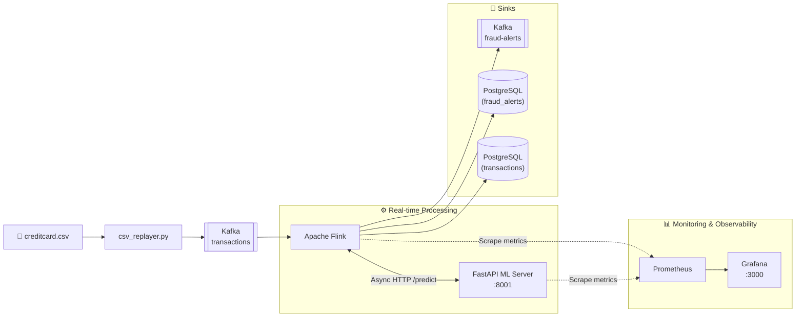

# 🛡️ Hệ Thống Phát Hiện Gian Lận Theo Thời Gian Thực v1.0 (Real-Time Fraud Detection Pipeline)

Một hệ thống dữ liệu (data pipeline) hoàn chỉnh, sẵn sàng cho môi trường production dùng để phát hiện gian lận thẻ tín dụng theo thời gian thực. Dự án này sử dụng sức mạnh xử lý luồng của **Apache Flink** kết hợp bất đồng bộ với Engine học máy **Machine Learning** (XGBoost) được triển khai qua FastAPI. Hệ thống đi kèm với tính năng giám sát toàn diện thông qua **Prometheus & Grafana**, khả năng thay thế mô hình ML linh hoạt (Hot-swapping / Model Versioning) mà không cần thời gian downtime (zero-downtime).

---

## 🏗️ Kiến trúc & Luồng dữ liệu (Data Flow)

Hệ thống hoạt động dựa trên mô hình học máy thông minh giúp phát hiện các mẫu gian lận tinh vi với độ trễ cực thấp:


```mermaid
flowchart LR
    CSV["📁 creditcard.csv"] --> REP["csv_replayer.py"]
    REP --> KAFKA_TXN[["Kafka\ntransactions"]]

    subgraph Cluster ["⚙️ Real-time Processing"]
        FLINK["Apache Flink"]
        API["FastAPI ML Server\n:8001"]
        FLINK <-->|Async HTTP /predict| API
    end

    KAFKA_TXN --> FLINK

    subgraph Sinks ["💾 Sinks"]
        KAFKA_ALERT[["Kafka\nfraud-alerts"]]
        PG[("PostgreSQL\n(fraud_alerts)")]
        PG_TXN[("PostgreSQL\n(transactions)")]
    end

    FLINK --> KAFKA_ALERT & PG & PG_TXN

    subgraph Monitoring ["📊 Monitoring & Observability"]
        PROM["Prometheus"]
        GRAF["Grafana\n:3000"]
        PROM --> GRAF
    end

    FLINK & API -.->|Scrape metrics| PROM
```


1. **Thu thập dữ liệu (Mô phỏng):** Một script Python ([csv_replayer.py](./scripts/csv_replayer.py)) đọc dữ liệu thẻ tín dụng từ Kaggle, tự động phân tích cấu hình từ tệp `.env`, và giả lập đẩy các sự kiện (JSON) vào Kafka topic `transactions` theo thời gian thực.
2. **Engine Xử Lý Luồng (Apache Flink):**
   - **Data Validation:** Xác thực dữ liệu Kafka qua [TransactionDeserializer.java](./src/main/java/com/fraud/serialization/TransactionDeserializer.java). Nếu gặp dữ liệu lỗi, Flink ghi nhận vào metric `malformed_messages_total` thay vì làm sập job.
   - **Machine Learning (Async I/O):** Flink gọi bất đồng bộ sang FastAPI server thông qua [MLInferenceFunction.java](./src/main/java/com/fraud/function/MLInferenceFunction.java) để nhận điểm xác suất gian lận từ mô hình XGBoost. Kết nối HTTP được quản lý qua pool kết nối bất đồng bộ và được thiết lập timeout 4 giây (ngắn hơn Flink timeout 5s) giúp kích hoạt cơ chế tự phục hồi (fail-open) khi FastAPI quá tải mà không làm sập Flink Job.
3. **Data Sinks:** Các cảnh báo từ AI được bắn ra Kafka topic `fraud-alerts` ([FraudAlertSerializer.java](./src/main/java/com/fraud/serialization/FraudAlertSerializer.java)) và lưu trữ lâu dài vào PostgreSQL ([AlertJdbcSink.java](./src/main/java/com/fraud/sink/AlertJdbcSink.java)).
4. **Observability:** Prometheus thu thập chỉ số (throughput, latency, tỷ lệ lỗi) từ Flink và FastAPI để Grafana trực quan hóa lên Dashboard.

---

## 📂 Cấu trúc Dự Án

```text
.
├── docker-compose.yml          # Triển khai Hạ tầng (Kafka, Postgres, Prometheus, Grafana)
├── .env                        # Các biến môi trường, ports (KAFKA_PORT, MODEL_SERVER_PORT, v.v.)
├── init-db/                    # Script khởi tạo PostgreSQL
│   └── 01_schema.sql           # Schema cho bảng `transactions` và `fraud_alerts`
├── ml/                         # Module Machine Learning
│   ├── download_dataset.sh     # Tải dữ liệu Kaggle
│   ├── train_model.py          # Script huấn luyện XGBoost (sử dụng RobustScaler, bộ lọc IQR, scale_pos_weight)
│   ├── model_server.py         # FastAPI quản lý `/predict` và `/models` (hỗ trợ atomic hot-swapping)
│   ├── tests/                  # Bộ Test tự động cho FastAPI
│   └── models/                 # Registry (`model_registry.json`) và các file .pkl lưu phiên bản mô hình
├── monitoring/                 # Module Giám sát
│   ├── prometheus.yml          # Cấu hình Prometheus Scraping
│   └── grafana/                # Cấu hình và Dashboard Grafana
├── pom.xml                     # Thư viện Maven cho Flink
├── scripts/                    # Các tiện ích
│   ├── create_topics.sh        # Script tạo Kafka topics
│   └── csv_replayer.py         # Trình mô phỏng giao dịch
└── src/main/java/com/fraud/    # Mã nguồn trung tâm Apache Flink (Java 17)
    ├── config/                 # Cấu hình Pipeline (PipelineConfig.java đọc biến môi trường và .env)
    ├── function/               # Flink functions (Async ML Inference)
    ├── model/                  # Data objects (Transaction, FraudAlert)
    ├── serialization/          # Kafka Deserializers & Validation
    └── sink/                   # Kết nối PostgreSQL JDBC
```

---

## 🛠️ Công Nghệ Sử Dụng

- **Stream Processing:** Apache Flink 1.20 (Java 17)
- **Message Broker:** Apache Kafka 7.6 & Confluent ZooKeeper
- **Database:** PostgreSQL 16
- **Observability:** Prometheus & Grafana
- **Machine Learning:** XGBoost, Scikit-Learn (RobustScaler, SMOTE), Pandas
- **Model Server:** FastAPI, Uvicorn, Python 3.12 (uv)
- **Kiểm thử (Testing):** Pytest

---

## ⚙️ Yêu Cầu Cài Đặt (Prerequisites)

- **Java 17** và **Maven 3.8+** (để biên dịch Java code của Flink)
- **Python 3.11/3.12** với `uv` hoặc `pip` (để chạy Model Server và Replayer)
- **Docker 24+** (hỗ trợ Docker Compose v2) để chạy hạ tầng và cụm Flink
- **Kaggle API Credentials** (`~/.kaggle/kaggle.json`) để tải dữ liệu training.

---

## 🗺️ Port Mapping

*(Các port này có thể thay đổi linh hoạt thông qua file `.env`)*

| Port       | Dịch vụ                        | Chức năng                                    |
|------------|--------------------------------|----------------------------------------------|
| 8081       | Flink Web UI                   | Theo dõi Job Flink và Backpressure           |
| 9093       | Kafka Broker (External)        | Nơi kết nối Kafka producer/consumer          |
| 2182       | ZooKeeper                      | Quản lý Kafka cluster                        |
| 5433       | PostgreSQL                     | Kết nối Database (`frauddb`)                 |
| 8001       | FastAPI ML server              | Endpoints: `/predict`, `/models`, `/metrics` (MODEL_SERVER_PORT) |
| 9090       | Prometheus                     | Giám sát metric                              |
| 3000       | Grafana                        | Xem Dashboard Thời gian thực                 |
| 9249-9260  | Flink Prometheus Reporters     | Thu thập số liệu nội bộ của Flink            |

---

## 🚀 Hướng Dẫn Khởi Chạy

Bạn nên sử dụng nhiều cửa sổ Terminal để chạy lần lượt các bước dưới đây.

### 1. Hạ tầng (Infrastructure)
Bật Kafka, Zookeeper, Postgres, Prometheus và Grafana. Đừng quên copy `.env.example` thành `.env` trước nhé!
```bash
docker compose up -d
```

### 2. Thiết lập Kafka
```bash
# Tạo các topics cần thiết
./scripts/create_topics.sh
```

### 3. Trí tuệ Nhân tạo (Machine Learning)
```bash
# Tải bộ dataset (yêu cầu Kaggle API key)
./ml/download_dataset.sh

# Huấn luyện mô hình XGBoost
uv run python ml/train_model.py
```

### 4. Bật API Model Server (Terminal A)
Giữ Terminal này luôn chạy để Flink có thể giao tiếp với AI và Prometheus có thể lấy metric.
```bash
# Chạy trực tiếp qua script Python đọc cấu hình cổng từ .env
uv run python ml/model_server.py
```

### 5. Biên Biên Dịch Java Code và Nộp Job (Terminal B)
Dùng Maven để đóng gói Fat JAR và triển khai trực tiếp vào container Flink JobManager.
```bash
# Biên dịch JAR cục bộ
mvn clean package -DskipTests

# Nộp Job vào cụm Flink chạy trong Docker
docker exec -it flink-jobmanager flink run -d /opt/flink/usrlib/fraud-detection-pipeline-1.0.jar
```
*Truy cập [http://localhost:8081](http://localhost:8081) để kiểm tra UI và trạng thái Job Flink.*

### 6. Bật Trình Giả Lập Dữ Liệu (Terminal C)
Script này sẽ giả vờ làm cổng thanh toán, bơm liên tục các giao dịch vào Kafka.
```bash
PYTHONPATH=. uv run python scripts/csv_replayer.py --speed 5
```

---

## 📊 Quan Sát (Monitoring & Observability)

Sau khi dòng dữ liệu bắt đầu chảy, bạn có thể kiểm tra sức khỏe hệ thống:

1. **Grafana Dashboard:** Vào `http://localhost:3000` (User: `admin` / Pass: `fraudadmin` - hoặc xem trong `.env`). Mở **Dashboards > Fraud Pipeline**.
2. **Kiểm tra Database:**
   ```bash
   docker exec -i fraud-postgres psql -U frauduser -d frauddb -c "
   SELECT pattern_name, severity, amount, source FROM fraud_alerts LIMIT 5;
   "
   ```

---

## 🧠 Quản Lý Phiên Bản Model (Hot-Swapping)

Server Machine Learning lưu toàn bộ lịch sử các mô hình đã huấn luyện trong `model_registry.json`.
Giả sử bạn vừa train lại thông số AI và muốn thay đổi mô hình ngay lập tức mà không muốn Flink bị gián đoạn:

1. Chạy `uv run python ml/train_model.py` để ra version mới.
2. Kiểm tra các version đang có sẵn:
   ```bash
   curl -s http://localhost:8001/models
   ```
3. **Hot-Swap Model (Thay nóng):** Kích hoạt version mới (hoặc Rollback về version cũ):
   ```bash
   curl -X POST http://localhost:8001/models/<version-id>/activate
   ```
   *Ngay lập tức, Server AI sẽ nạp mô hình mới vào RAM thông qua phép gán atomic swap, và Flink sẽ được dùng mô hình mới nhất này cho các giao dịch tiếp theo.*

---

## 🧪 Kiểm Thử (Automated Testing)

- **Test Python (FastAPI/ML Server):** Đảm bảo API scale dữ liệu chuẩn xác, và tính năng chuyển đổi model linh hoạt.
  ```bash
  PYTHONPATH=. uv run pytest ml/tests/
  ```

---

## 🔄 Hướng Dẫn Chạy Lại Từ Đầu (Reset Dữ Liệu Cũ)

Nếu bạn muốn làm sạch hệ thống và chạy lại dữ liệu mô phỏng từ đầu:

1. **Dừng và xóa sạch dữ liệu cũ (Containers, Volumes, và Topics)**:
   ```bash
   docker compose down -v
   ```
2. **Xóa lưu trữ Flink Checkpoints trên host**:
   ```bash
   rm -rf /tmp/flink-checkpoints/
   ```
3. **Khởi động lại hạ tầng Docker**:
   ```bash
   docker compose up -d
   ```
4. **Tạo lại các Kafka topics**:
   ```bash
   ./scripts/create_topics.sh
   ```
5. **Nộp lại Job Flink** (không cần compile lại JAR nếu code không đổi):
   ```bash
   docker exec -it flink-jobmanager flink run -d /opt/flink/usrlib/fraud-detection-pipeline-1.0.jar
   ```
6. **Chạy lại Model Server và Replayer** ở các terminal tương ứng:
   ```bash
   # Terminal A - Chạy AI Model Server (nếu đã tắt)
   PYTHONPATH=. uv run python ml/model_server.py

   # Terminal C - Phát lại dữ liệu giao dịch từ đầu
   PYTHONPATH=. uv run python scripts/csv_replayer.py --speed 5
   ```

---

## 🛑 Hướng Dẫn Tắt Hệ Thống

```bash
# Xóa các container Docker (bao gồm cả Kafka, Postgres, Flink, v.v.)
docker compose down
```
